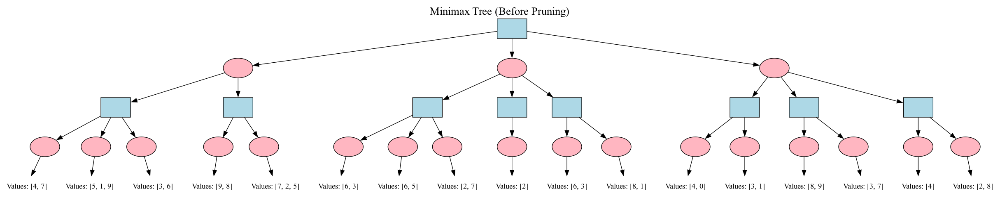
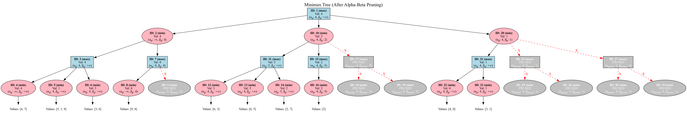

# 搜索技术总结

!!! abstract "课程信息"
    *   **课程名称：** 人工智能（专业必修）
    *   **授课对象：** 计算机科学与技术专业 二年级
    *   **课程学分：** 3学分
    *   **核心内容：** 第四章 搜索技术 (I, II, III)

## 一、搜索技术概览 (Search Technology I)

搜索是人工智能中解决问题的一种基本方法。许多问题，尤其那些没有特定解决算法的问题，都可以通过将其转化为搜索问题来求解。

### 1.1 搜索可以解决的问题

*   **问题求解 (Problem solving by search):** 许多AI问题可以通过搜索找到解决方案。
*   **游戏策略:** 搜索在游戏AI（如棋类游戏）中取得了显著成果。
*   **其他AI问题:** 机器人路径规划、自然语言处理、机器学习等领域也有应用。

!!! tip "搜索的本质：假设推理"
    搜索过程可以看作是一种假设推理，它涉及到回答以下问题：
    1.  **我在哪？ (What state am I?)** - 当前的状态或资源。
    2.  **我能干吗？ (What actions can I take?)** - 可以执行的操作，如星际争霸中的防守、建造、攻击。
    3.  **我到哪里去？ (What state should I achieve?)** - 目标状态，如击败对手。
    通过这种推理，我们可以规划出一系列动作来达到期望的状态。

### 1.2 搜索问题的形式化定义

要使用搜索算法解决问题，首先需要对问题进行形式化定义。这包括以下几个关键组成部分：

!!! note "形式化定义要素"
    *   **状态空间 (State Space):** 对问题所有可能状态的集合的形式化表示。
    *   **动作 (Action):** 从一个状态转移到另一个状态的操作的形式化表示。
    *   **初始状态 (Initial State):** 代理（agent）开始时的状态。
    *   **目标 (Goal):** 期望达到的一个或多个状态的描述。可以通过一个**目标测试 (Goal Test)** 函数来判断当前状态是否为目标状态。
    *   **解 (Solution):** 从初始状态到目标状态的一个动作序列。
    *   **前进成本 (Path Cost):** 从状态 $x$ 通过动作 $a$ 到达状态 $y$ 所需的成本，记为 $C(x, a, y)$。如果 $y$ 无法从 $x$ 通过 $a$ 到达，则成本为 $\infty$。
    *   **启发式方法 (Heuristics):** (将在后续讨论) 用于指导搜索方向的额外知识。

!!! warning "注意"
    搜索只展示了如何在问题被正确形式化之后如何解决它。问题的正确表述至关重要。

**后继函数 (Successor Function):**

一个状态 $x$ 经过一个动作后可以到达的状态集合 $S(x)$。

由于一个状态可能通过不同动作到达不同后继，或通过不同动作到达相同后继，后继函数通常返回 `<状态, 动作>` 对的集合，例如 $S(x) = \{\langle y, a \rangle, \langle z, b \rangle\}$。

#### 示例1：罗马尼亚路径规划

*   **问题:** 从 Arad 到 Bucharest，尽快到达。
*   **状态空间:** 罗马尼亚境内的任一城市。
*   **动作:** 在相邻城市之间移动。
*   **初始状态:** 在 Arad。
*   **目标状态:** 在 Bucharest。
*   **解:** 从 Arad 到 Bucharest 途径的城市序列。

#### 示例2：倒水问题 (Water Jug Problem)

*   **问题:** 有一个3加仑的壶和一个4加仑的壶，如何精确量出特定量的水（例如，4加仑壶中有2加仑水）？
*   **状态空间:** `(gal3, gal4)` 对，表示两个壶中水的加仑数。例如 (0,0), (3,4)。
*   **动作:**
    *   `Empty-3-Gallon`, `Empty-4-Gallon`
    *   `Fill-3-Gallon`, `Fill-4-Gallon`
    *   `Pour-3-into-4`, `Pour-4-into-3`
*   **初始状态:** 例如 (0,0)。
*   **目标状态:** 例如 (x,2) 或 (1,3)。

#### 示例3：八数码难题 (8-Puzzle Problem)

*   **问题:** 将打乱的数字方格恢复到目标排列。
*   **状态空间:** 各种不同的方格摆放方式。
*   **初始状态:** 给定的初始方格摆放。
*   **目标状态:** 目标方格摆放。
*   **动作:** 向上/下/左/右移动空格。
*   八数码问题属于滑块难题，是二维组合谜题。魔方是三维组合谜题。

#### 示例4：吸尘器世界 (Vacuum Cleaner World)

*   **问题描述:** 吸尘器清扫两个房间，每个房间可能是干净或不干净的。吸尘器有向左、向右、吸尘动作。
*   **物理状态:** 描述了世界的确切状态，例如 `(吸尘器位置, A房状态, B房状态)`。共有 $2 \times 2^2 = 8$ 种物理状态。
*   **认知状态 (Knowledge State):** 智能体对世界状态的认知。它可能是物理状态的一个子集。例如，智能体知道自己在几个物理状态之一，但不确定是哪一个。
    *   **目标:** 所有房间都干净。
    *   **初始认知状态 (完全不清楚):** {1,2,3,4,5,6,7,8} (所有8个物理状态的集合)
    *   一个动作序列如 `<right, suck, left, suck>` 可以保证达到目标，无论初始物理状态是哪个。
        *   {1,2,3,4,5,6,7,8} $\xrightarrow{right}$ {2,4,6,8} $\xrightarrow{suck}$ {4,8} $\xrightarrow{left}$ {3,7} $\xrightarrow{suck}$ {7}
        *   状态7代表 (吸尘器在A房, A房干净, B房干净)。

### 1.3 搜索过程：树搜索与图搜索

*   **边界 (Frontier / Open List):** 存储已生成但尚未扩展（探索）的节点的集合。初始时，边界只包含初始状态。
*   **已扩展节点 (Explored Set / Closed List):** 存储已经被扩展过的节点的集合。

**树搜索 (Tree Search):**

1.  将初始状态放入边界。
2.  循环：

    a.  如果边界为空，则失败。

    b.  从边界中选择一个节点 $n$ 进行扩展。

    c.  如果 $n$ 是目标状态，则返回从初始状态到 $n$ 的路径。

    d.  将 $n$ 的所有子节点（后继节点）加入边界。

**图搜索 (Graph Search):**

与树搜索类似，但会维护一个“已探索”集合，避免重复扩展已访问过的状态，从而处理状态空间图中的环路。

1.  将初始状态放入边界，已探索集合为空。
2.  循环：

    a.  如果边界为空，则失败。

    b.  从边界中选择一个节点 $n$ 进行扩展，并将其移出边界，加入已探索集合。

    c.  对于 $n$ 的每个子节点 $c$:
        i.  如果 $c$ 不在已探索集合中，也不在边界中，则如果 $c$ 是目标状态，返回路径，否则将 $c$ 加入边界。
        ii. (对于某些算法如UCS/A*) 如果 $c$ 在边界中但新的路径更优，则替换边界中的旧节点。


!!! note "路径 vs. 状态"
    在某些搜索问题（如路径规划）中，边界存储的是到达某个状态的**路径**，而不仅仅是状态本身。这对于计算路径成本和处理循环很重要。

### 1.4 搜索算法的评价标准

!!! success "评价标准"
    *   **完备性 (Completeness):** 如果问题存在解，算法是否总能找到解？
    *   **最优性 (Optimality):** 算法是否总能找到成本最低的解（当动作有成本时）？
    *   **时间复杂度 (Time Complexity):** 找到解最多需要探索/生成多少个节点？通常用 $b$ (最大分支因子) 和 $d$ (最浅目标节点深度) 或 $m$ (状态空间最大深度) 表示。
    *   **空间复杂度 (Space Complexity):** 算法最多需要将多少个节点储存在内存中？

从边界选择节点的顺序对搜索的性能有至关重要的影响。

## 二、无信息搜索 (Uninformed Search)

无信息搜索（也称盲目搜索）策略不使用任何关于问题领域特定知识（如距离目标的远近估计）。它们仅按照固定的规则选择下一个要扩展的状态。

### 2.1 宽度优先搜索 (Breadth-First Search, BFS)

*   **策略:** 总是扩展边界中最浅的未扩展节点。这可以通过将新生成的子节点添加到边界的**末尾**（FIFO队列）来实现。
*   **过程:** 逐层探索搜索树。先探索深度为0的节点，然后是深度为1的节点，以此类推。
*   **属性:**
    *   **完备性:** 是 (如果 $b$ 是有限的)。
    *   **最优性:** 是 (如果所有动作成本相同)。
    *   **时间复杂度:** $O(b^d)$ (最坏情况需要生成到 $d+1$ 层部分节点，即 $1+b+b^2+...+b^d + b(b^d-1)$)。
    *   **空间复杂度:** $O(b^d)$ (需要存储边界中的所有节点)。
*   **缺点:** 空间复杂度是主要瓶颈。

#### 示例：倒水问题 (BFS)
初始状态 (0,0)，目标状态 (*,2)。

1.  Frontier = {<(0,0)>}
2.  Expand (0,0) -> (3,0), (0,4). Frontier = {<(0,0),(3,0)>, <(0,0),(0,4)>}
3.  Expand (3,0) -> (0,0), (3,4), (0,3). Frontier = {<(0,0),(0,4)>, <(0,0),(3,0),(0,0)>, <(0,0),(3,0),(3,4)>, <(0,0),(3,0),(0,3)>}
    (假设 (0,0)是路径的第一个元素)
    ... 如果找到目标 (x,2)，则停止。

### 2.2 一致代价搜索 (Uniform-Cost Search, UCS)

*   **策略:** 总是扩展从初始状态到当前节点路径成本 $g(n)$ 最低的未扩展节点。这通常用优先队列实现。
*   **过程:** 类似于BFS，但不是扩展最浅的节点，而是扩展路径成本最低的节点。
*   **属性:**
    *   **完备性:** 是 (如果动作成本 $\epsilon > 0$ 且 $b$ 有限)。
    *   **最优性:** 是。
    *   **时间复杂度:** $O(b^{1+\lfloor C^*/\epsilon \rfloor})$，其中 $C^*$ 是最优解的成本，$\epsilon$ 是最小动作成本。
    *   **空间复杂度:** $O(b^{1+\lfloor C^*/\epsilon \rfloor})$。
*   **注意:** 如果所有动作成本相同，UCS 等价于 BFS。

### 2.3 深度优先搜索 (Depth-First Search, DFS)

*   **策略:** 总是扩展边界中最深的未扩展节点。这可以通过将新生成的子节点添加到边界的**最前端**（LIFO栈）来实现。
*   **过程:** 沿着一条路径尽可能深地探索，直到达到叶节点或无法再扩展，然后回溯到上一个未完全探索的节点。
*   **属性:**
    *   **完备性:** 否 (在无限深或有环路的状态空间中可能陷入死循环)。是 (在有限状态空间且进行环路检测时)。
    *   **最优性:** 否 (找到的第一个解不一定是最优的)。
    *   **时间复杂度:** $O(b^m)$，其中 $m$ 是状态空间的最大深度（可能远大于 $d$）。
    *   **空间复杂度:** $O(bm)$ (只需要存储当前路径上的节点及其兄弟节点，线性空间复杂度是其主要优点)。

#### 示例：倒水问题 (DFS)
初始状态 (0,0)，目标状态 (*,2)。

1.  Frontier = {<(0,0)>}
2.  Expand (0,0) -> (3,0), (0,4). Frontier = {<(0,0),(3,0)>, <(0,0),(0,4)>} (假设(3,0)在前面)
3.  Expand (3,0) -> (0,0), (3,4), (0,3). Frontier = {<(0,0),(3,0),(0,0)>, <(0,0),(3,0),(3,4)>, <(0,0),(3,0),(0,3)>, <(0,0),(0,4)>}
    ...

### 2.4 深度受限搜索 (Depth-Limited Search, DLS)

*   **策略:** DFS，但预先设定一个最大搜索深度 $L$。深度超过 $L$ 的节点不予扩展。
*   **属性:**
    *   **完备性:** 否 (如果最浅目标深度 $d > L$)。是 (如果 $d \le L$)。
    *   **最优性:** 否。
    *   **时间复杂度:** $O(b^L)$。
    *   **空间复杂度:** $O(bL)$。

### 2.5 迭代加深搜索 (Iterative Deepening Search, IDS)

*   **策略:** 结合了BFS的完备性/最优性（成本相同时）和DFS的空间优势。它通过多次执行DLS，深度限制 $L$ 从0开始逐步增加（0, 1, 2, ...）。
*   **过程:**
    1.  $L=0$, 执行 DLS。
    2.  $L=1$, 执行 DLS。
    3.  $L=2$, 执行 DLS。
    4.  ... 直到找到解。
*   **属性:**
    *   **完备性:** 是。
    *   **最优性:** 是 (如果所有动作成本相同)。
    *   **时间复杂度:** $O(b^d)$。虽然会重复生成节点，但主要开销在最深的那一层，与BFS同阶。 $(d+1)b^0 + db^1 + (d-1)b^2 + ... + 1b^d = O(b^d)$。
    *   **空间复杂度:** $O(bd)$。
*   **优点:** 通常是无信息搜索中的首选方法，当状态空间大且解的深度未知时。

### 2.6 双向搜索 (Bidirectional Search)

*   **策略:** 同时从初始状态向前搜索和从目标状态向后搜索（需要目标状态明确且动作可逆），当两个搜索的边界相遇时停止。
*   **属性 (假设都用BFS):**
    *   **完备性:** 是。
    *   **最优性:** 是 (如果动作成本一致且都用BFS)。
    *   **时间复杂度:** $O(b^{d/2})$。
    *   **空间复杂度:** $O(b^{d/2})$。
*   **难点:** 如何有效地进行反向搜索（后继函数可能难以求逆，或目标状态有多个）。

### 2.7 处理重复状态 (环路检测)

*   **路径检测 (Path Checking):** 确保新生成的节点 $c$ 与其所在路径上的祖先节点都不相同。即，单独检测每条路径是否出现重复节点。
*   **环检测 (Cycle Checking / Graph Search):** 记录下所有**已扩展过**的节点。当扩展节点 $n_k$ 获得子节点 $c$ 时，确保节点 $c$ 不等于之前任何扩展过的节点。
    *   对于UCS，使用环检测仍能找到最优解，因为UCS第一次扩展到某个节点时，已经找到了到达该节点的成本最低的路径。

### 无信息搜索策略总结

| 策略             | 完备性  | 最优性 (成本一致) | 时间复杂度     | 空间复杂度     |
| ---------------- | ------- | ----------------- | -------------- | -------------- |
| 宽度优先 (BFS)   | 是      | 是                | $O(b^d)$       | $O(b^d)$       |
| 一致代价 (UCS)   | 是      | 是                | $O(b^{C^*/\epsilon+1})$ | $O(b^{C^*/\epsilon+1})$ |
| 深度优先 (DFS)   | 否      | 否                | $O(b^m)$       | $O(bm)$        |
| 深度受限 (DLS)   | 否 ($d>L$) | 否                | $O(b^L)$       | $O(bL)$        |
| 迭代加深 (IDS)   | 是      | 是                | $O(b^d)$       | $O(bd)$        |
| 双向搜索 (BDS)   | 是      | 是                | $O(b^{d/2})$   | $O(b^{d/2})$   |

($b$: 分支因子, $d$: 最浅解深度, $m$: 最大深度, $L$: 深度限制, $C^*$: 最优解成本, $\epsilon$: 最小动作成本)

## 三、启发式搜索 (Heuristic Search) (Search Technology I & II)

无信息搜索策略在搜索过程中不对状态优劣进行判断。启发式搜索则利用问题领域的特定知识来评估状态的“前景”，从而更有效地指导搜索。

### 3.1 启发式函数 $h(n)$

*   **定义:** 对于一个具体问题，构造专用于该领域的启发式函数 $h(n)$，该函数用于估计从节点 $n$ 到达目标节点的成本。
*   **要求:** 对于所有满足目标条件的节点 $n_{goal}$，$h(n_{goal}) = 0$。
*   **来源:**
    *   当前节点到目标的某种距离或差异的度量。
    *   当前节点处于最佳路径的概率。
    *   某种条件下的主观if-then规则。

#### 示例：八数码难题的启发式函数
*   **$h_1(n)$:** 错位的牌的数量 (不包括空格)。
*   **$h_2(n)$:** 所有牌到其目标位置的曼哈顿距离之和。

### 3.2 贪婪最佳优先搜索 (Greedy Best-First Search)

*   **策略:** 总是扩展启发式函数 $h(n)$ 值最小的节点。即评估函数 $f(n) = h(n)$。
*   **过程:** 贪婪地选择看起来离目标最近的节点。
*   **属性:**
    *   **完备性:** 否 (可能陷入死循环，或在有限图中找到非目标状态的局部最优)。是 (在有限图且进行环检测时)。
    *   **最优性:** 否。
    *   **时间复杂度:** 最坏 $O(b^m)$，但好的启发函数可以显著减少。
    *   **空间复杂度:** 最坏 $O(b^m)$。
*   **缺点:** 忽略了已经付出的成本 $g(n)$，可能“误入歧途”。

### 3.3 A* 搜索 (A-Star Search)

A* 搜索结合了 UCS (考虑已付出成本) 和贪婪最佳优先搜索 (考虑未来成本估计) 的思想。

*   **评估函数:** $f(n) = g(n) + h(n)$
    *   $g(n)$: 从初始状态到节点 $n$ 的实际路径成本。
    *   $h(n)$: 从节点 $n$ 到目标状态的估计成本 (启发式函数)。
    *   $f(n)$: 经过节点 $n$ 从初始状态到达目标节点的路径成本的估计值。
*   **策略:** 总是扩展 $f(n)$ 值最小的节点 (通常使用优先队列)。
*   **可采纳性 (Admissibility):**
    如果对于所有节点 $n$，启发式函数 $h(n)$ 满足 $h(n) \le h^*(n)$ (其中 $h^*(n)$ 是从 $n$ 到目标的最优实际成本)，则称 $h(n)$ 是可采纳的。
    可采纳的启发式函数从不“高估”到目标的成本。
    **A* 使用可采纳的启发式函数是树搜索最优的。**

*   **一致性 (Consistency / Monotonicity):**
    如果对于任意节点 $n_1$ 和通过动作 $a$ 到达的后继节点 $n_2$，满足 $h(n_1) \le c(n_1, a, n_2) + h(n_2)$，则称 $h(n)$ 是一致的。
    一致性是一个更强的条件。如果 $h(n)$ 是一致的，那么它一定是可采纳的。
    **如果 $h(n)$ 是一致的，A* 使用图搜索（即带环检测）也是最优的。** 当A*选择一个节点 $n$ 进行扩展时，它已经找到了到达 $n$ 的最优路径。
    路径上节点的 $f$ 值是非递减的：$f(n_2) \ge f(n_1)$ 如果 $n_2$ 是 $n_1$ 的后继。

*   **属性 (若 $h$ 可采纳/一致):**
    *   **完备性:** 是。
    *   **最优性:** 是。
    *   **时间复杂度:** 依赖于启发函数的质量。最坏情况仍是指数级，但好的启发函数可以使其接近 $O(b^d)$ 或 $O(d)$ (如果启发函数非常精确)。
    *   **空间复杂度:** 存储所有边界节点，通常是主要瓶颈，与时间复杂度同阶。

#### A* 搜索的性质 (若 $h$ 一致)
1.  一条路径上的节点的 $f$ 函数值是非递减的。
2.  如果节点 $n_2$ 在节点 $n_1$ 之后被扩展，则有 $f(n_1) \le f(n_2)$。
3.  在遍历节点 $n$ 时，所有 $f$ 值小于 $f(n)$ 的节点都已经被遍历过了。
4.  A* 搜索第一次扩展到某个状态，其已经找到到达该状态的最小成本路径。

#### 示例：八数码难题 (A*)
使用 $h(n)$ = 曼哈顿距离之和。

初始状态:
```
2 8 3
1 6 4
7   5
```
目标状态:
```
1 2 3
8   4
7 6 5
```
对初始状态:
$g(\text{initial}) = 0$

$h(\text{initial})$ = (1的距离) + (2的距离) + ... + (8的距离)

$f(\text{initial}) = g(\text{initial}) + h(\text{initial})$

### 3.4 迭代加深 A* (Iterative Deepening A*, IDA*)

*   **策略:** 类似于 IDS，但使用 $f$ 值作为界限，而不是深度。
*   **过程:** 每次迭代设置一个 $f$ 值上限 (cutoff)。从初始状态开始进行类似DFS的搜索，但剪掉 $f(n)$ 超过当前 cutoff 的分支。如果未找到解，则增加 cutoff (通常设为上次迭代中被剪掉的最小 $f$ 值) 并重新开始。
*   **属性:**
    *   **完备性:** 是 (如果 $h$ 可采纳)。
    *   **最优性:** 是 (如果 $h$ 可采纳)。
    *   **时间复杂度:** 仍可能较高，但通常优于纯A*。
    *   **空间复杂度:** $O(bd)$ (与DFS类似，存储当前路径)。这是IDA*的主要优势。

### 3.5 构造启发式函数

#### 3.5.1 松弛问题 (Relaxed Problems)

一种有效的构造可采纳启发式函数的方法是考虑原问题的松弛版本。松弛问题通过移除原问题中的某些约束来简化问题。

*   **原理:** 松弛问题中从状态 $n$ 到目标的最优解成本是原问题中 $h^*(n)$ 的一个下界，因此是可采纳的。
*   **示例 (八数码):**
    1.  原约束: 方块A可移到B，若A与B相邻且B为空。
    2.  松弛1: 方块A可移到B，若A与B相邻 (忽略B是否为空)。 $\rightarrow$ $h(n)$ = 曼哈顿距离。
    3.  松弛2: 方块A可移到B，若B为空 (忽略相邻)。
    4.  松弛3: 方块A可移到B (忽略所有条件)。 $\rightarrow$ $h(n)$ = 错位的牌数。

#### 3.5.2 模式数据库 (Pattern Databases) - 未在PPT详述，但相关

预计算状态空间中某些子问题（模式）到其目标模式的确切成本，并存储在数据库中。一个状态的启发值可以由其包含的模式的启发值组合得到。

#### 3.5.3 学习启发式函数 - 未在PPT详述，但相关

从经验中学习启发式函数。

### 3.6 启发式函数的支配 (Dominance)

*   **定义:** 如果有两个可采纳的启发式函数 $h_1(n)$ 和 $h_2(n)$，并且对于所有非目标节点 $n$，都有 $h_2(n) \ge h_1(n)$，则称 $h_2$ **支配** $h_1$。
*   **定理:** 如果 $h_2$ 支配 $h_1$，那么使用 A* 算法时，采用 $h_2$ 扩展的节点集合是采用 $h_1$ 扩展节点集合的子集（或相等）。即，$h_2$ 通常更有效。
*   **示例 (八数码):** 曼哈顿距离 ($h_2$) 支配 错位的牌数 ($h_1$)，因为每个错位的牌至少需要移动一格（曼哈顿距离 $\ge 1$）。

### 3.7 启发式搜索应用示例

#### 积木世界 (Blocks World)
*   **状态:** 积木的排列。
*   **动作:** `move(x,y)` (把x放y上，x和y顶都空)，`moveToTable(x)` (把x放桌上，x顶空且x不在桌上)。
*   **启发式函数:**
    *   $h_1(n)$: 不在目标位置的积木数 (可采纳，单调)。
    *   更好的启发式：考虑“good tower”（以某积木为顶的塔出现在目标状态中）。如果一个动作能创建good tower，执行它；否则，把一个非good tower的积木移到桌上。

#### 传教士与野人问题 (Missionaries and Cannibals)
*   **状态:** $(M, C, B)$ 表示左岸传教士数，左岸野人数，船在左岸(1)或右岸(0)。
*   **目标:** $(0, 0, 0)$
*   **约束:** 任何地方传教士数 $\ge$ 野人数，或传教士数=0。
*   **启发式函数 (N=3, K=2):**
*   
    $h(M, C, B) = M+C-2B$ (PPT中推导)

    当 $B=1$ (船在左)，$h = M+C-2$。

    当 $B=0$ (船在右)，$h = M+C$。

    这个启发式是单调的。

#### 游戏AI中的路径规划
*   怪物追逐玩家，需要找到最短路径，避开障碍。
*   状态：怪物位置。
*   动作：向8个方向移动。
*   $g(n)$: 已走步数。
*   $h(n)$: 当前位置到玩家位置的直线距离 (欧氏距离或曼哈顿距离)。这是可采纳的。

## 四、对抗搜索 (Adversarial Search) (Search Technology II)

当环境中存在其他智能体，其利益可能与我方冲突时，需要使用对抗搜索。这常见于游戏中。

### 4.1 博弈论基础

*   **特点:**
    *   多个玩家，各有利益。
    *   玩家行动会改变世界状态。
    *   决策依赖于对其他玩家行动的预测。
*   **关注的博弈类型:**
    *   双人 (Two players)
    *   离散 (Discrete states/actions)
    *   有限 (Finite states/actions)
    *   完美信息 (Perfect information, e.g., no hidden cards)
    *   确定性 (No chance elements like dice)
    *   零和 (Zero-sum, one player's gain is another's loss) - 或常数和。

#### 示例：剪刀石头布
单步博弈，可以用收益矩阵表示。

玩家I选行，玩家II选列。格子内为 (玩家I得分 / 玩家II得分)。

1:赢, 0:平, -1:输。

| P1 \ P2 | 石头(R) | 布(P) | 剪刀(S) |
|---------|---------|-------|---------|
| 石头(R) | 0/0     | -1/1  | 1/-1    |
| 布(P)   | 1/-1    | 0/0   | -1/1    |
| 剪刀(S) | -1/1    | 1/-1  | 0/0     |

### 4.2 Minimax 算法

用于确定性、完美信息、轮流行动的双人零和博弈中的最优策略。

*   **形式化定义:**
    *   玩家: A (Max) 和 B (Min)。Max试图最大化效用，Min试图最小化效用。
    *   状态集合 $S$。
    *   初始状态 $I \in S$。
    *   终止状态 $T \subseteq S$。
    *   后继函数 $Successors(state, player)$。
    *   效益/收益函数 $Utility(terminal\_state) \rightarrow \mathbb{R}$ (从Max玩家角度)。
*   **核心思想:**
    *   构建完整博弈树（或搜索到一定深度）。
    *   叶节点（终止状态）标记其效用值。
    *   向上反向传播效用值：
        *   Max节点: 取其子节点效用值的最大值。
        *   Min节点: 取其子节点效用值的最小值。
*   **算法 (深度优先实现 DFMiniMax):**
    ```
    function DFMiniMax(node, player):
        if node is TERMINAL:
            return Utility(node)

        children = node.Successors(player)
        if player == MAX:
            best_value = -infinity
            for each child in children:
                value = DFMiniMax(child, MIN)
                best_value = max(best_value, value)
            return best_value
        else: // player == MIN
            best_value = +infinity
            for each child in children:
                value = DFMiniMax(child, MAX)
                best_value = min(best_value, value)
            return best_value
    ```

### 4.3 Alpha-Beta 剪枝 (Alpha-Beta Pruning)

Minimax算法的优化，通过剪枝避免搜索不影响最终决策的子树。

*   **Alpha ($\alpha$):** Max节点当前路径上能确保的**最小**得分。初始化为 $-\infty$。
*   **Beta ($\beta$):** Min节点当前路径上能确保的**最大**得分。初始化为 $+\infty$。
*   **剪枝规则:**
    *   **Alpha剪枝 (在Min节点处):** 如果当前Min节点的$\beta$值 $\le$ 其任何Max祖先节点的$\alpha$值，则停止扩展该Min节点的其余子节点。因为Max玩家绝不会选择导致这个Min节点的路径。
    *   **Beta剪枝 (在Max节点处):** 如果当前Max节点的$\alpha$值 $\ge$ 其任何Min祖先节点的$\beta$值，则停止扩展该Max节点的其余子节点。因为Min玩家绝不会让Max玩家走到这个Max节点。
*   **传递:** $\alpha$和$\beta$值在DFS搜索时向下传递。
*   **效果:** Alpha-Beta剪枝不改变Minimax的最终结果。最优情况下（子节点按最优顺序排列），搜索的节点数可以从 $O(b^m)$ 减少到 $O(b^{m/2})$，相当于搜索深度减半。

### 4.4 有限深度的博弈与评价函数

对于复杂游戏（如象棋、围棋），博弈树非常巨大，无法搜索到终止状态。

*   **解决方法:** 限制搜索深度（例如，搜索 $k$ 步）。
*   **评价函数 (Evaluation Function, $Eval(s)$):**
    *   在搜索深度达到限制时，对非终止状态 $s$ 进行估值。
    *   $Eval(s)$ 估计了当前局面对Max玩家的有利程度。
    *   要求：
        1.  对于终止节点，其排序应与真实效用函数一致。
        2.  计算不能太耗时。
        3.  对于非叶子节点，应与该节点实际获胜概率强相关。
*   **线性加权评价函数:**
    $Eval(s) = w_1 f_1(s) + w_2 f_2(s) + ... + w_n f_n(s) = \sum_{i=1}^{n} w_i f_i(s)$
    其中 $f_i(s)$ 是局面的某个特征值（如棋子数量、控制区域等），$w_i$ 是权重。权重可以通过专家经验或机器学习得到。

#### 示例：井字棋的评价函数
*   $X_n$: 只有 $n$ 个X且没有O的行/列/对角线数量。
*   $O_n$: 只有 $n$ 个O且没有X的行/列/对角线数量。
*   $Eval(s) = 3X_2(s) + X_1(s) - (3O_2(s) + O_1(s))$
    (如果 $X_3=1$, $Eval=+\infty$; 如果 $O_3=1$, $Eval=-\infty$)

### 4.5 蒙特卡洛树搜索 (Monte Carlo Tree Search, MCTS)

一种不依赖于显式评价函数的博弈树搜索算法，在围棋等复杂游戏中表现出色 (如AlphaGo)。

*   **核心思想:** 通过大量随机模拟（playouts）来评估局面的好坏，并利用这些信息指导树的扩展。
*   **四个主要步骤，反复迭代:**
    1.  **选择 (Selection):** 从根节点开始，根据某种策略（如UCT - Upper Confidence Bound 1 applied to Trees）递归选择子节点，直到到达一个叶节点L或未完全扩展的节点。
        $UCT = \frac{w_i}{n_i} + c \sqrt{\frac{\ln N}{n_i}}$ ( $w_i$: 第i个子节点的胜场数, $n_i$: 第i个子节点的访问次数, $N$: 父节点访问次数, $c$:探索常数)
    2.  **扩展 (Expansion):** 如果L不是终止节点，随机选择一个L的未扩展子节点M加入树中。
    3.  **模拟 (Simulation / Playout):** 从新节点M开始，使用一个（通常较简单的）随机策略进行快速对局，直到游戏结束。
    4.  **反向传播 (Backpropagation / Backup):** 将模拟结果（赢/输）从M沿着选择路径反向传播回根节点，更新路径上每个节点的统计信息（如访问次数、获胜次数）。
*   **AlphaGo的改进:** 使用深度神经网络（价值网络评估局面，策略网络选择落子）来改进选择、扩展和模拟阶段。

## 五、局部搜索 (Local Search) (Search Technology III)

当问题的解与到达目标的路径无关，只关心最终状态时（如八皇后、TSP、电路设计），局部搜索算法非常有用。它们通常只维护一个当前状态，并尝试通过局部修改来改进它。

### 5.1 局部搜索算法特点

*   从单个当前状态出发，通常只移动到与之相邻的状态。
*   不保留搜索路径。
*   优点：内存占用少，常用于状态空间非常大的优化问题。
*   目标：找到目标函数最优（最大或最小）的状态。
*   类比：在地形图中找到最高峰（全局最大值）或最低谷（全局最小值）。

### 5.2 爬山搜索 (Hill Climbing)

一种贪婪的局部搜索算法。

*   **策略:** 从当前状态出发，选择能使其值（或海拔）增加最多的邻居状态。如果所有邻居都不比当前状态好，则停止。
*   **算法:**
    ```
    function Hill-Climbing(problem):
        current = Make-Node(Initial-State[problem])
        loop do:
            neighbor = a highest-valued successor of current
            if Value[neighbor] <= Value[current]:
                return State[current] // 达到局部最优
            current = neighbor
    ```
*   **问题 (陷阱):**
    *   **局部极大值 (Local Maximum):** 比邻居都高，但不是全局最高。算法会卡住。
    *   **高原 (Plateau):** 评价函数平坦的区域。可能无法找到出路。
    *   **山脊 (Ridge):** 一系列局部极大值，可能导致搜索方向受限。

#### 爬山法的改进
*   **允许侧向移动 (Sideways Moves):** 在高原上，如果邻居与当前状态值相同，允许移动一定的次数，以期望走出高原。
*   **随机爬山法 (Stochastic Hill Climbing):** 在上山移动中随机选择下一步，选择概率与陡峭程度相关。
*   **首选爬山法 (First-Choice Hill Climbing):** 随机生成后继，直到找到一个比当前节点更优的。
*   **随机重启爬山法 (Random-Restart Hill Climbing):** 多次从随机生成的初始状态开始进行爬山搜索。如果每次成功的概率是 $p$，期望重启次数是 $1/p$。这使得算法在概率上是完备的。

### 5.3 模拟退火 (Simulated Annealing, SA)

借鉴物理退火过程，是一种能跳出局部最优的随机优化算法。

*   **物理退火:** 将固体加热到高温，然后缓慢冷却，使其分子达到低能稳定状态。
*   **SA思想:**
    *   在高温时，允许以较大概率接受一个更差的解（“坏”移动），以探索更广阔的空间。
    *   随着温度（控制参数 $T$）逐渐降低，接受差解的概率也逐渐减小。
    *   最终，当温度很低时，算法趋向于只接受更好的解，类似爬山法。
*   **Metropolis准则 (接受概率):**
    *   如果新状态 $s'$ 比当前状态 $s$ 好 ($\Delta E = E(s') - E(s) < 0$)，则接受 $s'$。
    *   如果新状态 $s'$ 比当前状态 $s$ 差 ($\Delta E > 0$)，则以概率 $P = e^{-\Delta E / T}$ 接受 $s'$。
*   **算法流程:**
    1.  初始化：当前状态 $s$，初始温度 $T_0$，终止条件。
    2.  循环 (外层，控制温度)：
        a.  循环 (内层，在当前温度下达到平衡)：
            i.  从当前状态 $s$ 的邻域中随机产生一个新状态 $s'$。
            ii. 计算能量差 $\Delta E = E(s') - E(s)$ (目标函数值，求最小值则 $E(s)=f(s)$)。
            iii.如果 $\Delta E < 0$，则 $s \leftarrow s'$。
            iv. 否则，生成随机数 $rand \in [0,1)$，如果 $rand < e^{-\Delta E / T}$，则 $s \leftarrow s'$。
        b.  降低温度 $T$ (退火调度，如 $T_{k+1} = \alpha T_k$, $0 < \alpha < 1$)。
    3.  直到满足终止条件 (如温度足够低，或解长时间无改进)。

*   **关键参数 (退火历程 Annealing Schedule):**
    *   **初始温度 ($T_0$):** 足够高，以允许广泛探索。
    *   **状态产生函数 (邻域函数):** 如何从当前解生成候选解。
    *   **状态接受函数:** Metropolis准则。
    *   **温度更新函数 (降温速率):** 如何降低温度。
    *   **内循环终止准则:** 在每个温度下迭代多少次。
    *   **外循环终止准则:** 算法何时停止。
*   **优缺点:**
    *   优点: 理论上能找到全局最优（若冷却足够慢），对初值不敏感，简单通用。
    *   缺点: 收敛速度可能较慢，参数选择影响性能。

#### SA 应用示例：背包问题、TSP

*   **背包问题:**
    *   解表示: 0/1序列 (物品是否被选中)。
    *   邻域: 翻转一位 (选中变不选中，反之亦然)，同时保持背包容量约束。
    *   能量函数: $-(\text{总价值})$ (因为SA通常求最小值)。
*   **TSP问题:**
    *   解表示: 城市排列。
    *   邻域: 交换两个城市位置 (2-opt)，或反转一段路径。
    *   能量函数: 总路径长度。

### 5.4 遗传算法 (Genetic Algorithms, GA)

受生物进化（自然选择、遗传、变异）启发的全局优化搜索算法。

*   **核心概念:**
    *   **个体 (Individual):** 问题的一个潜在解。
    *   **染色体 (Chromosome):** 个体的编码表示 (如二进制串、实数向量、排列)。
    *   **基因 (Gene):** 染色体上的一个基本单元。
    *   **种群 (Population):** 一组个体。
    *   **适应度函数 (Fitness Function):** 评价个体优劣的函数，通常与目标函数相关。
*   **基本流程 (迭代进行):**
    1.  **初始化 (Initialization):** 随机生成一个初始种群。
    2.  **评估 (Evaluation):** 计算种群中每个个体的适应度。
    3.  **选择 (Selection):** 根据适应度选择个体作为父代进行繁殖。适应度高的个体有更大几率被选中 (如轮盘赌选择、锦标赛选择)。
    4.  **交叉 (Crossover / Recombination):** 两个父代个体交换部分基因，产生一个或多个子代个体 (如单点交叉、两点交叉、均匀交叉)。交叉概率 $P_c$。
    5.  **变异 (Mutation):** 以较小的概率随机改变子代个体的一个或多个基因，引入新的遗传物质，防止早熟收敛。变异概率 $P_m$。
    6.  形成新一代种群，重复步骤2-5，直到满足终止条件 (如达到最大代数、解的质量不再显著提高)。

#### GA 的关键要素
*   **编码方案:** 如何将问题的解表示为染色体。
    *   二进制编码: 适用于离散参数。
    *   实数编码: 适用于连续参数，直接操作。
    *   排列编码: 适用于顺序问题，如TSP。
*   **适应度函数设计:**
    *   最大化问题: $Fit(x) = f(x)$
    *   最小化问题: $Fit(x) = \frac{1}{f(x)}$ (若 $f(x)>0$) 或 $Fit(x) = C_{max} - f(x)$ (若 $f(x) \ge 0$)。
    *   需要处理欺骗问题 (如过早收敛、停滞)，可能需要适应度定标。
*   **选择策略:**
    *   适应度比例选择 (轮盘赌): 个体被选概率与其适应度成正比。
    *   排序选择: 按适应度排序后分配选择概率。
    *   锦标赛选择: 随机选k个个体，最优者胜出。
*   **交叉算子:**
    *   单点交叉、两点交叉、均匀交叉 (适用于二进制/实数编码)。
    *   PMX (Partially Mapped Crossover)、OX (Order Crossover)、CX (Cycle Crossover) (适用于排列编码，如TSP)。
*   **变异算子:**
    *   位翻转 (二进制)。
    *   随机改变值 (实数)。
    *   交换、插入、倒置 (排列编码)。
*   **参数设置:** 种群大小、交叉概率、变异概率、最大代数。

#### GA 应用示例：函数优化 (Rastrigin)、TSP
*   **Rastrigin函数优化:**
    $f(x_1, x_2) = 20 + x_1^2 + x_2^2 - 10(\cos(2\pi x_1) + \cos(2\pi x_2))$
    编码: $x_1, x_2$ 可以用二进制串或直接用实数表示。
*   **TSP (排列编码):**
    *   染色体: 城市访问顺序，如 (3-2-5-4-7-1-6-9-8)。
    *   交叉: PMX, OX等。
    *   变异: 交换两个城市，倒置一段子路径。
    *   适应度: $1 / (\text{总路径长度})$。

## 六、总结

搜索技术是人工智能的核心组成部分，提供了解决各种复杂问题的通用框架。

*   **无信息搜索** 奠定了基础，适用于问题信息较少的情况。
*   **启发式搜索** 通过引入领域知识（启发式函数）显著提高了搜索效率，A*是其中的代表。
*   **对抗搜索** 解决了多智能体竞争环境下的决策问题，Minimax和Alpha-Beta剪枝是经典方法，MCTS则在更复杂博弈中表现优异。
*   **局部搜索** 适用于优化问题和路径无关的解探索，爬山法、模拟退火和遗传算法是常用技术，它们在巨大状态空间中寻找满意解方面各有优势。

理解这些搜索算法的原理、特性、适用场景及优缺点，对于设计高效的AI系统至关重要。

## 课后作业

!!! question "问题一"
    利用 A* 搜索算法求解8数码问题，问最少移动多少次就可达到目标状态？
    
    画出搜索树，并在搜索树上标注出各状态的估价函数值。
    
    估价函数定义为 $f(n) = g(n) + h(n)$，其中 $g(n)$ 为节点 $n$ 的深度，如 $g(S0)=0$。$h(n)$ 为节点 $n$ 与目标棋局不相同的位数（不包括空格），简称“不在位数”，如 $h(S0)=4$。

    

??? note "答案（仅供参考）"
    ```md
    S0
    2 8 3
    1 6 4
    7 _ 5
    (g=0, h=4, f=4)
    |
    +-- S1
    |   2 8 3
    |   1 _ 4
    |   7 6 5
    |   (g=1, h=3, f=4)  [扩展]
    |    |
    |    +-- S4
    |    |   2 _ 3
    |    |   1 8 4
    |    |   7 6 5
    |    |   (g=2, h=3, f=5)  [扩展]
    |    |    |
    |    |    +-- S7
    |    |    |   _ 2 3
    |    |    |   1 8 4
    |    |    |   7 6 5
    |    |    |   (g=3, h=2, f=5)  [扩展]
    |    |    |    |
    |    |    |    +-- S11
    |    |    |    |   1 2 3
    |    |    |    |   _ 8 4
    |    |    |    |   7 6 5
    |    |    |    |   (g=4, h=1, f=5)  [扩展]
    |    |    |    |    |
    |    |    |    |    +-- S_TARGET (目标!)
    |    |    |    |    |   1 2 3
    |    |    |    |    |   8 _ 4
    |    |    |    |    |   7 6 5
    |    |    |    |    |   (g=5, h=0, f=5)
    |    |    |    |    |
    |    |    |    |    `-- S12
    |    |    |    |        1 2 3
    |    |    |    |        7 8 4
    |    |    |    |        _ 6 5
    |    |    |    |        (g=5, h=2, f=7)
    |    |    |    |
    |    |    |    `-- S8
    |    |    |        2 3 _
    |    |    |        1 8 4
    |    |    |        7 6 5
    |    |    |        (g=3, h=4, f=7)
    |    |    |
    |    |    `-- (父节点 S1)
    |    |
    |    +-- S5
    |    |   2 8 3
    |    |   _ 1 4
    |    |   7 6 5
    |    |   (g=2, h=3, f=5)  [扩展]
    |    |    |
    |    |    +-- S9
    |    |    |   _ 8 3
    |    |    |   2 1 4
    |    |    |   7 6 5
    |    |    |   (g=3, h=3, f=6)
    |    |    |
    |    |    +-- S10
    |    |    |   2 8 3
    |    |    |   7 1 4
    |    |    |   _ 6 5
    |    |    |   (g=3, h=4, f=7)
    |    |    |
    |    |    `-- (父节点 S1)
    |    |
    |    +-- S6
    |    |   2 8 3
    |    |   1 4 _
    |    |   7 6 5
    |    |   (g=2, h=4, f=6)
    |    |
    |    `-- (父节点 S0)
    |
    +-- S2
    |   2 8 3
    |   1 6 4
    |   _ 7 5
    |   (g=1, h=5, f=6)
    |
    `-- S3
        2 8 3
        1 6 4
        7 5 _
        (g=1, h=5, f=6)
    ```

!!! question "问题二"
    对于8数码问题，令启发式函数h(n)为所有数码的当前位置与其目标位置的曼哈顿距离之和。基于上述h(n)，用A*搜索算法求解初始状态和目标状态如下图所示的8数码问题。
    
    对于空白格，规定其按照向上、向下、向左、向右的顺序进行移动。画出搜索图，并在图中标明所有状态的f，g，h值。

    初始：	
    ```md
    1	2	3
        8	4
    7	6	5
    ```

    目标：
    ```md
    2	8	3
    1	6	4
    7		5
    ```

    注：每次行动的成本为1，左右（或上下）相邻数码的曼哈顿距离为1。可使用环检测。

??? note "答案（仅供参考）"
    ```md
    S0 (g=0, h=4, f=4)
    1 2 3
    8 4
    7 6 5
    |
    +-- [U] S1 (g=1, h=3, f=4)
    |     _ 2 3
    |     1 8 4
    |     7 6 5
    |      |
    |      +-- [D] S4 (S0) (g=2, h=4, f=6) [Cycle, g(S0)=0 < g(S4)=2]
    |      |     1 2 3
    |      |       8 4
    |      |     7 6 5
    |      |
    |      `-- [R] S5 (g=2, h=2, f=4)
    |            2 _ 3
    |            1 8 4
    |            7 6 5
    |             |
    |             +-- [D] S6 (g=3, h=1, f=4)
    |             |     2 8 3
    |             |     1 _ 4
    |             |     7 6 5
    |             |      |
    |             |      +-- [U] S9 (S5) (g=4, h=2, f=6) [Cycle, g(S5)=2 < g(S9)=4]
    |             |      |     2 _ 3
    |             |      |     1 8 4
    |             |      |     7 6 5
    |             |      |
    |             |      +-- [D] S10 (ST) (g=4, h=0, f=4) <<< GOAL!
    |             |      |     2 8 3
    |             |      |     1 6 4
    |             |      |     7 _ 5
    |             |      |
    |             |      +-- [L] S11 (g=4, h=2, f=6)
    |             |      |     2 8 3
    |             |      |     _ 1 4
    |             |      |     7 6 5
    |             |      |
    |             |      `-- [R] S12 (g=4, h=2, f=6)
    |             |            2 8 3
    |             |            1 4 _
    |             |            7 6 5
    |             |
    |             +-- [L] S7 (S1) (g=3, h=3, f=6) [Cycle, g(S1)=1 < g(S7)=3]
    |             |     _ 2 3
    |             |     1 8 4
    |             |     7 6 5
    |             |
    |             `-- [R] S8 (g=3, h=3, f=6)
    |                   2 3 _
    |                   1 8 4
    |                   7 6 5
    |
    +-- [D] S2 (g=1, h=5, f=6)
    |     1 2 3
    |     7 8 4
    |       6 5
    |
    `-- [R] S3 (g=1, h=5, f=6)
        1 2 3
        8 _ 4
        7 6 5
    ```

!!! question "问题三"

    在下图所示的博弈树中，方框表示极大方，圆圈表示极小方。以优先生成左边结点的顺序来进行α-β剪枝搜索，试在博弈树上给出何处发生剪枝的标记。

    

??? note "答案（仅供参考）"
    
    
    [参考代码（code）](minmaxtree.hidden.md)