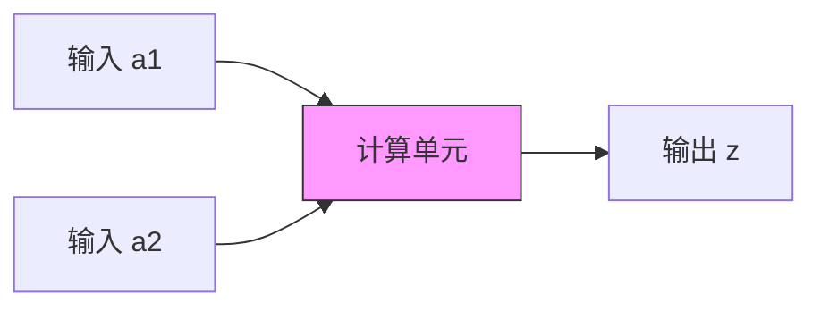
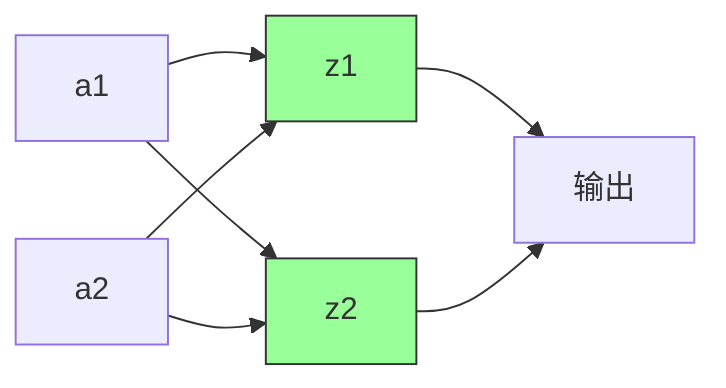

# 机器学习 - 神经网络

## 一、机器学习与神经网络概述

### 1. 机器学习核心目标
机器学习的核心目标是通过数据学习一个函数 $f(x)$，完成从输入到输出的映射。主要分为：

*   **回归 (Regression)：** 函数的输出是一个数值。
*   **分类 (Classification)：** 函数的输出是一个类别。
*   **生成 (Generation)：** 函数的输出是一个数据（如图像、文本）。

### 2. 神经网络 (Neural Networks)
*   **起源：** 尝试模拟生物大脑的算法。
*   **历史：** 80年代和90年代初广泛使用，90年代末期热度有所下降，近年来凭借其卓越性能在许多应用中成为最先进的技术并再次复苏。
*   **类比人脑：** 人脑神经网络是由大量具有适应性的简单同构单元（神经元）组成的广泛并行互连网络，能够模拟生物神经系统对真实世界的交互反应。

## 二、神经元模型

### 1. 生物神经元结构

*   **树突 (Dendrites)：** 多个，主要用来接受传入信息。
*   **轴突 (Axon)：** 一条，尾端有许多轴突末梢。
*   **突触 (Synapse)：** 轴突末梢与其他神经元的树突产生连接，传递信号。
*   **信息传递：** 当神经元接收的信号累积到一定阈值时，会释放神经递质，通过突触刺激下一个神经元。

### 2. MP神经元模型 (McCulloch-Pitts Neuron Model, 1943)

这是最早的抽象神经元模型，类比生物神经元结构：

*   **输入 (Inputs)：** 类比树突，接收信号。
*   **计算 (Computation)：** 类比细胞核，处理信息。
*   **输出 (Output)：** 类比轴突，传递信号。

一个典型的MP神经元模型包含：

*   $N$ 个输入：$a_1, a_2, \dots, a_N$
*   对应的权值 (Weights)：$w_1, w_2, \dots, w_N$
*   一个求和单元：计算输入的加权和 $ \sum_{i=1}^{N} w_i a_i $
*   一个非线性激活函数 (Activation Function) $g(\cdot)$
*   一个输出：$z$

**输出计算过程：**

输入信号首先被加权求和：
$$ \text{sum} = w_1 a_1 + w_2 a_2 + \dots + w_N a_N = \mathbf{w}^T \mathbf{a} $$
然后，加权和经过激活函数 $g$ 处理得到输出：
$$ z = g(\text{sum}) = g(\mathbf{w}^T \mathbf{a}) $$
在最初的MP模型中，激活函数 $g$ 通常是 **符号函数 (sign function, sgn)**：
$$ \text{sgn}(x) = \begin{cases} 1, & \text{if } x \ge 0 \\ -1, & \text{if } x < 0 \end{cases} $$

**模型理解：**
可以将神经元模型看作一个根据已知属性（特征）预测未知属性（目标）的单元。

*   已知属性值 (特征)：$a_1, a_2, a_3, \dots$
*   未知属性值 (目标)：$z$

**局限性：** MP模型中的权值 $w_i$ 是预先设定的，不能通过学习过程自动调整。

### 3. Hebb学习率 (Hebb's Rule, 1949)
心理学家Hebb提出，人脑神经细胞突触的强度（即连接权重）是可以变化的。这启发了研究者们思考如何通过调整权值让机器自我学习，为后续的感知机等学习算法奠定了基础。

## 三、感知机 (Perceptron)

感知机是由Frank Rosenblatt于1957年提出的，它在MP模型的基础上引入了权值学习机制。

### 1. 结构
感知机通常由两层神经元构成：

*   **输入层 (Input Layer)：** 接收输入数据，仅传递数据，不做计算。节点数等于特征维度。
*   **输出层 (Output Layer)：** 对前一层的输入进行计算。可以有一个或多个神经元。

如果输出层只有一个神经元，且激活函数为符号函数，则感知机是一个二分类模型。
感知机可以看作是 **单层神经网络** (指其只有一个计算层/权重层)。

### 2. 计算公式
对于有 $N$ 个输入 $a_1, \dots, a_N$ 和 $M$ 个输出神经元的感知机：

输入向量：$\mathbf{a} = [a_1, a_2, \dots, a_N]^T$

权重矩阵：$\mathbf{W} \in \mathbb{R}^{M \times N}$ (其中 $W_{ji}$ 是从输入 $a_i$ 到输出神经元 $z_j$ 的权重)

输出向量：$\mathbf{z} = [z_1, z_2, \dots, z_M]^T$

计算公式（以矩阵形式）：
$$ \mathbf{z} = g(\mathbf{W} \mathbf{a}) $$
其中 $g$ 是激活函数，逐元素应用于向量 $\mathbf{W} \mathbf{a}$。
例如，对于第 $j$ 个输出神经元：
$$ z_j = g\left(\sum_{i=1}^{N} W_{ji} a_i\right) $$

### 3. 感知机训练法则 (Perceptron Learning Rule)

与MP模型不同，感知机的权重 $\mathbf{W}$ 是通过训练得到的。

对于单个输出神经元的感知机 (二分类，激活函数为sgn)，其更新规则为：

令 $y$ 为真实目标标签 (+1 或 -1)，$\hat{y} = \text{sgn}(\mathbf{w}^T \mathbf{a})$ 为感知机输出。
权重更新：

$$ \mathbf{w}_{\text{new}} = \mathbf{w}_{\text{old}} + \Delta \mathbf{w} $$

$$ \Delta \mathbf{w} = \eta (y - \hat{y}) \mathbf{a} $$

其中 $\eta$ 是学习速率 (learning rate)，是一个小的正数 (如 0.1)。
训练目标是最小化预测错误，例如通过迭代调整权重直到所有训练样本都被正确分类（对于线性可分数据）。

### 4. 决策边界与局限性

*   **决策边界：** 感知机在特征空间中创建一个线性决策边界。对于二维数据，是一条直线；三维数据是一个平面；N维数据是一个N-1维的超平面。
    $$ \mathbf{w}^T \mathbf{a} = 0 $$
*   **局限性 (Minsky & Papert, 1969)：** 单层感知机只能解决线性可分问题。它无法解决像 **异或 (XOR)** 这样的简单非线性分类任务。
    *   XOR问题：
        *   (0, 0) -> 0
        *   (0, 1) -> 1
        *   (1, 0) -> 1
        *   (1, 1) -> 0
        在二维平面上，无法用一条直线将 XOR 的两类点分开。

## 四、多层感知机 (Multi-Layer Perceptron, MLP)

为了克服单层感知机的局限性，引入了多层感知机，即包含一个或多个隐藏层的神经网络。

### 1. 结构
MLP通常包含三个或更多层次：

*   **输入层 (Input Layer)：** 接收原始数据。
*   **隐藏层 (Hidden Layer(s))：** 一个或多个。这些层对输入数据进行非线性变换。
*   **输出层 (Output Layer)：** 输出最终结果（分类、回归值等）。

### 2. 数学表达式
考虑一个具有一个隐藏层的MLP：

*   输入向量：$\mathbf{x}$
*   输入层到隐藏层的权重矩阵：$\mathbf{W}^{(1)}$，偏置向量：$\mathbf{b}^{(1)}$
*   隐藏层的激活函数：$g_1$
*   隐藏层的输出：$\mathbf{h} = g_1(\mathbf{W}^{(1)}\mathbf{x} + \mathbf{b}^{(1)})$
*   隐藏层到输出层的权重矩阵：$\mathbf{W}^{(2)}$，偏置向量：$\mathbf{b}^{(2)}$
*   输出层的激活函数：$g_2$
*   最终输出 (预测值)：$\mathbf{\hat{y}} = g_2(\mathbf{W}^{(2)}\mathbf{h} + \mathbf{b}^{(2)})$

代入 $\mathbf{h}$：

$$ \mathbf{\hat{y}} = g_2(\mathbf{W}^{(2)} g_1(\mathbf{W}^{(1)}\mathbf{x} + \mathbf{b}^{(1)}) + \mathbf{b}^{(2)}) $$

**注意：** 偏置单元 (bias units) 通常会引入，它们的值恒为1，并与后一层的所有节点连接，其权重可学习。

### 3. 激活函数
在MLP中，通常使用平滑的、可微的非线性激活函数，常见的有：

*   **Sigmoid (Logistic) 函数：**

    $$ \sigma(x) = \frac{1}{1 + e^{-x}} $$

    输出范围 (0, 1)，常用于二分类问题的输出层或旧式网络的隐藏层。

*   **Tanh (双曲正切) 函数：**

    $$ \tanh(x) = \frac{e^x - e^{-x}}{e^x + e^{-x}} = 2\sigma(2x) - 1 $$

    输出范围 (-1, 1)，通常比Sigmoid在隐藏层中表现更好，因为其输出均值为0。

*   **ReLU (Rectified Linear Unit) 函数：**

    $$ \text{ReLU}(x) = \max(0, x) $$

    输出范围 $[0, \infty)$。目前在深度神经网络中非常流行，因其计算简单且能有效缓解梯度消失问题。

### 4. 通用近似定理 (Universal Approximation Theorem)

该定理表明：一个具有 **一个隐藏层**、**有限数量神经元** 和 **非线性激活函数** (如Sigmoid) 的MLP，可以以任意精度近似任何定义在输入空间紧集上的连续函数。

形式化表述（简化版）：
对于任何连续函数 $f(\mathbf{x})$，存在一个MLP $F(\mathbf{x})$ 使得对所有 $\mathbf{x}$：

$$ |F(\mathbf{x}) - f(\mathbf{x})| < \epsilon $$

其中 $\epsilon > 0$ 是一个任意小的正数。

这意味着MLP具有强大的函数拟合能力，因此能够解决XOR等非线性问题。

### 5. MLP如何解决非线性问题 (如XOR)？
*   **关键在于非线性激活函数和隐藏层。**
*   如果隐藏层使用线性激活函数，则整个MLP仍然是一个线性模型：

    $$\mathbf{W}^{(2)}(\mathbf{W}^{(1)}\mathbf{x} + \mathbf{b}^{(1)}) + \mathbf{b}^{(2)} = (\mathbf{W}^{(2)}\mathbf{W}^{(1)})\mathbf{x} + (\mathbf{W}^{(2)}\mathbf{b}^{(1)} + \mathbf{b}^{(2)}) = \mathbf{W}'\mathbf{x} + \mathbf{b}'$$

    这等效于一个单层线性模型。

*   **空间变换：** 隐藏层通过非线性激活函数对输入数据进行 **空间变换 (space transformation)**。原始线性不可分的数据，在变换后的新空间中可能变得线性可分。然后，输出层在这个新的表示空间中执行线性分类/回归。
*   **本质：** 多层神经网络的本质就是通过学习到的矩阵参数 ($\mathbf{W}, \mathbf{b}$) 与固定的非线性激活函数来拟合特征与目标之间的真实函数关系。

### 6. 隐藏层节点数的选择
*   输入层节点数由特征维度决定。
*   输出层节点数由目标维度（如分类类别数、回归值数量）决定。
*   隐藏层节点数是一个超参数，通常根据经验或通过 **网格搜索 (Grid Search)** 等超参数优化方法来确定。

## 五、神经网络的训练

### 1. 损失函数 (Loss Function)
衡量模型预测值 $\mathbf{\hat{y}}$ 与真实目标值 $\mathbf{y}$ 之间差异的函数。训练的目标是最小化损失函数。
例如，对于回归问题，常用 **均方误差 (Mean Squared Error, MSE)**：
$$ \mathcal{L}(\mathbf{y}, \mathbf{\hat{y}}) = \frac{1}{2} ||\mathbf{y} - \mathbf{\hat{y}}||^2 = \frac{1}{2} \sum_i (y_i - \hat{y}_i)^2 $$
(常数 1/2 是为了求导方便)

### 2. 前向传播 (Forward Propagation)
从输入层开始，逐层计算神经元的输出，直到得到最终的输出层结果 $\mathbf{\hat{y}}$。

例如，对于一个两层网络 (一个隐藏层，一个输出层)：

1.  计算隐藏层输出：$\mathbf{h} = g_1(\mathbf{W}^{(1)}\mathbf{x} + \mathbf{b}^{(1)})$
2.  计算输出层输出：$\mathbf{\hat{y}} = g_2(\mathbf{W}^{(2)}\mathbf{h} + \mathbf{b}^{(2)})$

### 3. 反向传播 (Backward Propagation, BP)
反向传播算法是计算损失函数 $\mathcal{L}$ 关于网络中所有参数（权重 $\mathbf{W}$ 和偏置 $\mathbf{b}$）梯度的有效方法。它基于微积分中的 **链式法则 (Chain Rule)**。

梯度信息用于通过 **梯度下降 (Gradient Descent)** 或其变种 (如Adam, SGD) 来更新参数，以最小化损失函数。

**梯度下降更新规则：**

对于任意参数 $\theta$ (可以是某个 $W_{ij}$ 或 $b_i$)：

$$ \theta_{\text{new}} = \theta_{\text{old}} - \eta \frac{\partial \mathcal{L}}{\partial \theta} $$

其中 $\eta$ 是学习速率。

**BP过程概述：**

1.  **前向传播：** 计算网络每一层的输出，最终得到预测值 $\mathbf{\hat{y}}$ 和损失 $\mathcal{L}$。
2.  **反向传播梯度：**

    *   从输出层开始，计算 $\mathcal{L}$ 关于输出层激活值（激活函数作用后的值）的梯度。
    *   然后计算 $\mathcal{L}$ 关于输出层加权和（激活函数作用前的值）的梯度。
    *   接着计算 $\mathcal{L}$ 关于输出层权重 $\mathbf{W}^{(L)}$ 和偏置 $\mathbf{b}^{(L)}$ 的梯度。
    *   将梯度传播到前一层（第 $L-1$ 层），计算 $\mathcal{L}$ 关于第 $L-1$ 层激活值的梯度。
    *   依此类推，逐层向后计算梯度，直到输入层。

**示例：链式法则的应用 (考虑 $E_{\text{total}}$ 对 $w_5$ 的偏导)**

假设 $E_{\text{total}}$ 是总误差，$\text{out}_{o1}$ 是某个输出神经元的激活输出，$\text{net}_{o1}$ 是其加权输入， $w_5$ 是连接到 $\text{net}_{o1}$ 的一个权重。

$$ \frac{\partial E_{\text{total}}}{\partial w_5} = \frac{\partial E_{\text{total}}}{\partial \text{out}_{o1}} \times \frac{\partial \text{out}_{o1}}{\partial \text{net}_{o1}} \times \frac{\partial \text{net}_{o1}}{\partial w_5} $$

*   $\frac{\partial E_{\text{total}}}{\partial \text{out}_{o1}}$: 总误差对该神经元输出的偏导。如果 $E_{\text{total}} = \frac{1}{2}(\text{target}_{o1} - \text{out}_{o1})^2 + \dots$，则此项为 $-(\text{target}_{o1} - \text{out}_{o1})$。
*   $\frac{\partial \text{out}_{o1}}{\partial \text{net}_{o1}}$: 激活函数的导数。例如，如果激活函数是Sigmoid $\sigma(x)$，其导数为 $\sigma(x)(1-\sigma(x))$。所以此项为 $\text{out}_{o1}(1-\text{out}_{o1})$。
*   $\frac{\partial \text{net}_{o1}}{\partial w_5}$: 加权输入对权重 $w_5$ 的偏导。如果 $\text{net}_{o1} = w_5 \cdot \text{out}_{h1} + \dots$，则此项为 $\text{out}_{h1}$ (连接到 $w_5$ 的前一层神经元的输出)。

**反向传播到隐藏层 (例如，误差对 $w_1$ 的偏导)：**

当计算隐藏层权重的梯度时，需要将来自所有它所连接的后一层神经元的误差贡献加起来。

$$ \frac{\partial E_{\text{total}}}{\partial w_1} = \left( \sum_k \frac{\partial E_{\text{total}}}{\partial \text{out}_{ok}} \frac{\partial \text{out}_{ok}}{\partial \text{net}_{ok}} \frac{\partial \text{net}_{ok}}{\partial \text{out}_{h1}} \right) \times \frac{\partial \text{out}_{h1}}{\partial \text{net}_{h1}} \times \frac{\partial \text{net}_{h1}}{\partial w_1} $$

其中，$\text{out}_{h1}$ 是 $w_1$ 所连接的隐藏神经元的输出，$\text{out}_{ok}$ 是该隐藏神经元连接到的第 $k$ 个输出神经元的输出。

### 4. 梯度消失问题 (Vanishing Gradient Problem)

在使用Sigmoid或Tanh等饱和激活函数（在其取值范围两端梯度趋近于0）的深层网络中，梯度在反向传播时会逐层衰减。

*   Sigmoid函数的导数 $\sigma'(x) = \sigma(x)(1-\sigma(x))$ 的最大值是 0.25 (当 $x=0$ 时)。
*   当梯度从输出层向输入层传播时，每经过一层，梯度至少会乘以一个小于等于0.25的因子 (如果是Sigmoid) 和权重的乘积。
*   在层数很多的情况下，靠近输入层的梯度可能变得非常小 (趋近于0)，导致这些层的参数几乎不更新，网络难以训练。

### 5. ReLU激活函数与梯度消失
**ReLU (Rectified Linear Unit)** 函数及其导数：
$$ \text{ReLU}(x) = \max(0, x) $$
$$ \text{ReLU}'(x) = \begin{cases} 1, & \text{if } x > 0 \\ 0, & \text{if } x \le 0 \end{cases} $$
**ReLU的优点：**

1.  **缓解梯度消失：** 对于 $x > 0$ 的部分，导数恒为1，梯度可以无衰减地向后传播，有助于训练深层网络。
2.  **计算效率高：** 相比Sigmoid/Tanh，ReLU及其导数的计算非常简单。
3.  **稀疏性：** 对于 $x \le 0$ 的输入，ReLU的输出为0，这会使一部分神经元失活，从而使网络具有稀疏性，可能减少参数间的相互依赖，缓解过拟合。

## 六、总结
*   **人工神经元结构：** 模拟生物神经元，包含输入、加权、求和、激活、输出等步骤。
*   **感知机：** 单计算层网络，能解决线性分类问题，但无法处理XOR等非线性问题。
*   **多层感知机 (MLP)：** 通过引入隐藏层和非线性激活函数，能够拟合复杂的非线性函数关系（通用近似定理），解决非线性问题。关键在于隐藏层对数据的空间变换。
*   **训练：** 通过前向传播计算输出和损失，再通过反向传播计算梯度，并使用梯度下降等优化算法更新网络参数。
*   **挑战与改进：** 梯度消失问题可通过ReLU等激活函数得到缓解。

神经网络是现代机器学习和人工智能领域的核心技术之一，在计算机视觉、语音识别、自然语言处理等众多领域取得了巨大成功。

## 课后作业

!!! question "问题一"

    如图是一个MLP模型。现有一个仅包含一个数据的数据集，该数据输入 $x_1=1$，$x_2=0.5$，输出的目标值 $t=4$ 。如果随机初始化后，$w_1=0.5$， $w_2=1.5$，$w_3=2.3$， $w_4=3$， $w_5=1$， $w_6=1$，若学习率 $η=0.1$，激活函数均为 ReLU，求经过1轮反向传播后，权重的更新值 $w_5^+$ 和 $w_1^+$.

    

??? note "答案（仅供参考）"
    给定的初始值：

    *   $x_1 = 1, x_2 = 0.5$
    *   $t = 4$
    *   $w_1=0.5, w_2=1.5, w_3=2.3, w_4=3, w_5=1, w_6=1$
    *   $\eta = 0.1$
    *   激活函数: ReLU, $f(z) = \max(0, z)$, $f'(z) = 1$ if $z > 0$, $0$ if $z \le 0$.
    *   损失函数: $L = \frac{1}{2}(y-t)^2$

    **1. 前向传播**

    *   计算隐藏层输入：

        $net_{h1} = w_1 x_1 + w_2 x_2 = (0.5)(1) + (1.5)(0.5) = 0.5 + 0.75 = 1.25$
        $net_{h2} = w_3 x_1 + w_4 x_2 = (2.3)(1) + (3)(0.5) = 2.3 + 1.5 = 3.8$

    *   计算隐藏层输出 (经过ReLU)：

        $h_1 = \text{ReLU}(net_{h1}) = \text{ReLU}(1.25) = 1.25$
        $h_2 = \text{ReLU}(net_{h2}) = \text{ReLU}(3.8) = 3.8$

    *   计算输出层输入：

        $net_y = w_5 h_1 + w_6 h_2 = (1)(1.25) + (1)(3.8) = 1.25 + 3.8 = 5.05$

    *   计算输出层输出 (经过ReLU)：

        $y = \text{ReLU}(net_y) = \text{ReLU}(5.05) = 5.05$

    *   计算损失：

        $L = \frac{1}{2}(y-t)^2 = \frac{1}{2}(5.05 - 4)^2 = \frac{1}{2}(1.05)^2 = \frac{1}{2}(1.1025) = 0.55125$

    **2. 反向传播**

    由于 $net_y=5.05 > 0$, $net_{h1}=1.25 > 0$, $net_{h2}=3.8 > 0$，所有ReLU的导数在其激活区域内都为1。

    *   计算输出层误差项 $\delta_y$:

        $\delta_y = \frac{\partial L}{\partial y} \cdot \frac{\partial y}{\partial net_y} = (y-t) \cdot \text{ReLU}'(net_y) = (5.05 - 4) \cdot 1 = 1.05$

    *   **更新 $w_5$:**

        $w_5$ 是连接 $h_1$ 到 $y$ 的权重。
        
        $\frac{\partial L}{\partial w_5} = \delta_y \cdot \frac{\partial net_y}{\partial w_5} = \delta_y \cdot h_1 = 1.05 \cdot 1.25 = 1.3125$

        $\Delta w_5 = -\eta \frac{\partial L}{\partial w_5} = -0.1 \cdot 1.3125 = -0.13125$

        $w_5^+ = w_5 + \Delta w_5 = 1 - 0.13125 = 0.86875$

    *   **更新 $w_1$:**
        
        $w_1$ 是连接 $x_1$ 到 $h_1$ 的权重。
        
        $\frac{\partial L}{\partial w_1} = \delta_y \cdot \frac{\partial net_y}{\partial h_1} \cdot \frac{\partial h_1}{\partial net_{h1}} \cdot \frac{\partial net_{h1}}{\partial w_1}$
        
        *   $\frac{\partial net_y}{\partial h_1} = w_5 = 1$
        
        *   $\frac{\partial h_1}{\partial net_{h1}} = \text{ReLU}'(net_{h1}) = \text{ReLU}'(1.25) = 1$
        
        *   $\frac{\partial net_{h1}}{\partial w_1} = x_1 = 1$ (因为 $net_{h1} = w_1 x_1 + w_2 x_2$)

        所以, $\frac{\partial L}{\partial w_1} = \delta_y \cdot w_5 \cdot 1 \cdot x_1 = 1.05 \cdot 1 \cdot 1 \cdot 1 = 1.05$
        $\Delta w_1 = -\eta \frac{\partial L}{\partial w_1} = -0.1 \cdot 1.05 = -0.105$
        
        $w_1^+ = w_1 + \Delta w_1 = 0.5 - 0.105 = 0.395$