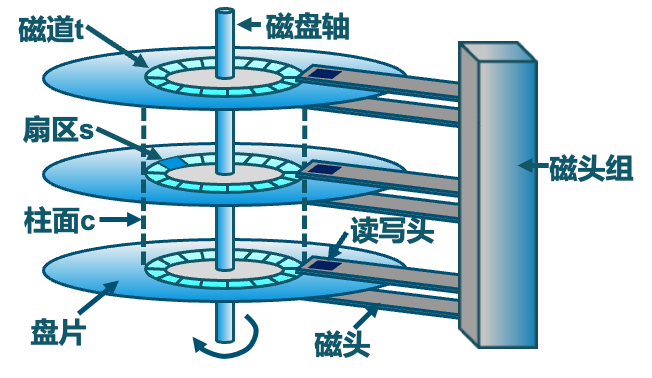

# 大容量存储

!!! abstract "课程目标"
    *   描述外存设备的物理结构及其对设备使用的影响；
    *   解释大容量存储设备的性能特点；
    *   评估磁盘调度算法；
    *   讨论大容量存储（RAID）提供的操作系统服务。

## 一、存储系统概述

计算机系统中的存储设备是分层次组织的，主要目的是在成本、速度和容量之间取得平衡。

!!! note "存储分层 (Storage Hierarchy)"
    典型的存储层次从上到下，速度递减，容量递增，每比特成本递减：
    
    1.  **寄存器 (Registers)**
    2.  **高速缓存 (Cache)**
    3.  **主存 (Main Memory - DRAM)**
    4.  **电子磁盘 (Solid State Disk - SSD)**
    5.  **磁盘 (Magnetic Disk - HDD)**
    6.  **光盘 (Optical Disk)**
    7.  **磁带 (Magnetic Tapes)**

本章主要关注大容量存储，特别是磁盘驱动器（HDD）和非易失性存储器（NVM）。

## 二、磁盘结构 (HDD)

### 2.1 物理结构

传统的机械硬盘（HDD）主要由以下物理组件构成：

*   **盘片 (Platters)**：圆形盘片，表面涂有磁性材料用于存储数据。
*   **磁头 (Heads)**：每个盘面都有一个磁头，负责读写数据。所有磁头固定在一个磁头臂上，同步移动。
*   **磁道 (Tracks)**：盘片上的一系列同心圆，数据记录在磁道上。
*   **柱面 (Cylinders)**：所有盘片上半径相同的磁道的集合。磁头在不同盘面之间切换比在同一盘面移动磁道要快，因此数据倾向于按柱面存储。
*   **扇区 (Sectors)**：磁道被划分成的若干个弧段，是磁盘读写的最小物理单位，通常为 512 字节或 4KB。
*   **簇 (Clusters)**：文件系统层面，由一个或多个连续的扇区组成，是文件分配的最小逻辑单位。

!!! question "扇区大小与数量"
    *   **扇区大小是固定的吗？** 在低级格式化时确定，对于一个磁盘而言，其物理扇区大小是固定的。
    *   **每个磁道的扇区数量是一样的吗？**
        *   传统磁盘（CAV - Constant Angular Velocity，恒定角速度）：内圈磁道和外圈磁道扇区数相同，但外圈磁道扇区物理长度更长，导致空间利用率不高。
        *   现代磁盘（CLV - Constant Linear Velocity，恒定线速度，或 ZBR - Zone Bit Recording，区域位记录）：外圈磁道比较内圈磁道拥有更多的扇区，以提高存储密度和数据传输率。

### 2.2 磁盘工作机制

读取或写入数据时，磁头必须被定位到期望的磁道，并等待所期望的扇区旋转到磁头下方。这个过程主要包含两个时间：

1.  **寻道时间 (Seek Time)**：将磁头臂移动到目标磁道（柱面）所花费的时间。这是影响磁盘性能的最主要因素。
    *   平均寻道时间通常在 3ms 到 12ms 之间。
2.  **旋转延迟 (Rotational Latency)**：等待目标扇区的起始位置旋转到磁头下方所花费的时间。
    *   平均旋转延迟 = $\frac{1}{2} \times \text{磁盘旋转一周所需时间}$
    *   磁盘旋转一周所需时间 = $\frac{60}{\text{RPM}}$ (秒)，其中 RPM 是每分钟转数。
    *   例如，7200 RPM 的磁盘，平均旋转延迟 = $\frac{1}{2} \times \frac{60}{7200} \text{ s} = 4.17 \text{ ms}$。

### 2.3 HDD 性能参数

*   **传输速率 (Transfer Rate)**：数据从磁盘传输到内存（或反之）的速率。
    *   理论传输速率 (e.g., 6 Gb/sec for SATA 3)
    *   有效传输速率 (e.g., 1 Gb/sec)
*   **访问延迟 (Access Latency)**：

    `Access Latency = Average Seek Time + Average Rotational Latency`

    *   例如，对于高速磁盘: $3ms + 2ms = 5ms$
    *   例如，对于低速磁盘: $9ms + 5.56ms = 14.56ms$

*   **平均 I/O 时间 (Average I/O Time)**：

    `Average I/O Time = Access Latency + (Amount to Transfer / Transfer Rate) + Controller Overhead`

    *   **示例**：传输一个 4KB 的块，磁盘参数为 7200 RPM，平均寻道时间 5ms，传输速率 1Gb/sec，控制器开销 0.1ms。

        *   平均寻道时间 = $5ms$
        *   平均旋转延迟 (7200 RPM) = $\frac{1}{2} \times \frac{60}{7200}s = 4.17ms$
        *   控制器开销 = $0.1ms$
        *   传输时间 = $\frac{4KB}{1Gb/s} = \frac{4 \times 1024 \times 8 \text{ bits}}{1 \times 10^9 \text{ bits/s}} \approx \frac{4 \times 8}{1024^2 \times 1000 / (1024^2)} \text{ ms} = \frac{32 \text{ Kb}}{1000 \text{ Mb/s}} = \frac{0.032 \text{ Mb}}{1000 \text{ Mb/s}} = 0.000032s = 0.032ms$
            *   PPT 中的计算: `Transfer time = 4KB / 1Gb/s * 8Gb / GB * 1GB / 1024^2KB = 32 / (1024^2) = 0.031 ms` (这里 PPT 的单位转换有点简化，但结果近似)
        *   平均 I/O 时间 = $5ms + 4.17ms + 0.1ms + 0.031ms = 9.301ms$

!!! info "第一块硬盘"
    1956 年，IBM RAMDAC 计算机包含了 IBM Model 350 磁盘存储系统，容量为 5M (7位) 字符，由 50 个 24 英寸的盘片组成，访问时间小于 1 秒。

## 三、非易失性内存 (NVM)

NVM（如固态硬盘 SSD）是一种即使在断电后也能保持数据存储的内存技术。

*   **特点**：
    *   比 HDD 更可靠（无移动部件）。
    *   每 MB 成本更高。
    *   可能有较短的寿命（写入次数限制），需要磨损均衡等管理技术。
    *   容量相对 HDD 可能较小（但差距在缩小）。
    *   **速度远快于 HDD**。
    *   无寻道时间或旋转延迟。
*   **接口**：传统 SATA 总线可能成为瓶颈，新的接口如 **NVMe (NVM Express)** 直接连接到 PCI-e 总线，提供更高带宽和更低延迟。
*   **形式**：SSD、USB 驱动器、主板集成存储、智能手机存储等。

!!! tip "易失性存储用作大容量存储"
    DRAM 也可以配置为 RAM 驱动器（RAM disk），提供极快的 I/O 性能，但数据在断电后会丢失。
    *   操作系统通过 RAM 进行缓冲和缓存。
    *   RAM 驱动器由用户控制，可用作高速临时存储。
    *   Linux 中有 `/dev/ram`，macOS 可用 `diskutil` 创建，文件系统类型如 `tmpfs`。

## 四、磁盘与主机的连接

磁盘驱动器通过 I/O 总线与主机系统连接。

*   **总线类型**：ATA, SATA (最常见), eSATA, SAS, USB, Fibre Channel (FC)。
*   **控制器**：
    *   **主机控制器 (Host Bus Adapter - HBA)**：在计算机端，管理总线。
    *   **磁盘控制器 (Device Controller)**：内置于磁盘驱动器中。
*   **通信**：主机通过内存映射 I/O 端口向主机控制器发送命令，主机控制器再向设备控制器发送消息。数据传输通常通过 DMA (Direct Memory Access) 在设备和主存之间进行。

## 五、地址映射

操作系统将磁盘视为一个由**逻辑块 (Logical Blocks)** 构成的一维数组。逻辑块是最小的传输单元。

*   **低级格式化 (Low-Level Formatting / Physical Formatting)**：在物理介质上创建逻辑块（扇区），并写入扇区头、数据区和 ECC（纠错码）。
*   **映射方式**：逻辑块号按顺序映射到磁盘扇区。通常从最外层柱面的第一个磁道的第一个扇区开始 (扇区0)，依次映射完一个磁道，然后是该柱面中的其余磁道，再从外向内扫描其他柱面。
*   **挑战**：
    *   **坏扇区 (Bad Sectors)**：磁盘控制器通常会维护一个坏扇区列表，并透明地将坏扇区重映射到备用扇区。
    *   **可变扇区数**：对于采用 CLV/ZBR 技术的磁盘，外圈磁道扇区更多，逻辑到物理地址的映射更复杂。

## 六、磁盘调度

操作系统负责高效使用磁盘硬件，主要目标是：

1.  **快速的访问时间 (Fast Access Time)**：主要通过最小化寻道时间实现。
2.  **高磁盘带宽 (High Disk Bandwidth)**：单位时间内传输的总字节数。
    `Disk Bandwidth = Total Bytes Transferred / (Time of First Request - Time of Last Transfer Completion)`

磁盘 I/O 请求可能来自操作系统、系统进程或用户进程。操作系统为每个磁盘维护一个请求队列。当磁盘繁忙时，新的请求必须排队，此时调度算法才有意义。

### 6.1 磁盘调度算法

假设当前磁头位置在 **53**，请求队列为：**98, 183, 37, 122, 14, 124, 65, 67**

1.  **先来先服务 (FCFS - First-Come, First-Served)**
    *   按请求到达顺序处理。
    *   公平，但效率不高，可能导致磁头臂移动距离过大。
    *   移动序列: 53 → 98 → 183 → 37 → 122 → 14 → 124 → 65 → 67
    *   总寻道长度: (98-53) + (183-98) + (183-37) + (122-37) + (122-14) + (124-14) + (124-65) + (67-65) = 45 + 85 + 146 + 85 + 108 + 110 + 59 + 2 = **640** 个柱面。

2.  **最短寻道时间优先 (SSTF - Shortest Seek Time First)**
    *   选择使磁头臂从当前位置移动最少的请求。
    *   可能导致某些请求饥饿（Starvation）。
    *   移动序列: 53 → 65 → 67 → 37 → 14 → 98 → 122 → 124 → 183
    *   总寻道长度: (65-53) + (67-65) + (67-37) + (37-14) + (98-14) + (122-98) + (124-122) + (183-124) = 12 + 2 + 30 + 23 + 84 + 24 + 2 + 59 = **236** 个柱面。

    !!! warning "SSTF 缺点"
        SSTF 算法虽然平均寻道时间较短，但如果不断有靠近当前磁头位置的新请求到达，远离磁头位置的请求可能会长时间得不到服务，产生“饥饿”现象。

3.  **扫描算法 (SCAN / 电梯算法 - Elevator Algorithm)**
    *   磁头在一个方向上移动，服务所有该方向上的请求，直到到达磁盘末端，然后反向。
    *   对两端的请求更友好。
    *   假设当前磁头从 53 开始向磁道号减小的方向移动 (朝0移动)。
    *   移动序列: 53 → 37 → 14 → 0 (到达端点) → 65 → 67 → 98 → 122 → 124 → 183
    *   总寻道长度: (53-37) + (37-14) + (14-0) + (65-0) + (67-65) + (98-67) + (122-98) + (124-122) + (183-124) = 16 + 23 + 14 + 65 + 2 + 31 + 24 + 2 + 59 = **236** 个柱面 (如果假设磁盘柱面从0到199)。
    *   如果磁头从 53 开始向磁道号增大的方向移动 (朝199移动)。
    *   移动序列: 53 → 65 → 67 → 98 → 122 → 124 → 183 → 199 (到达端点) → 37 → 14
    *   总寻道长度: (65-53) + (67-65) + (98-67) + (122-98) + (124-122) + (183-124) + (199-183) + (199-37) + (37-14) = 12 + 2 + 31 + 24 + 2 + 59 + 16 + 162 + 23 = **331** 个柱面。

4.  **循环扫描算法 (C-SCAN - Circular SCAN)**
    *   磁头只在一个方向上扫描并服务请求（例如，从外到内）。当到达磁盘一端后，立即返回到另一端（不服务任何请求），然后重新开始扫描。
    *   提供更均匀的等待时间。
    *   假设当前磁头从 53 开始向磁道号增大的方向移动。
    *   移动序列: 53 → 65 → 67 → 98 → 122 → 124 → 183 → 199 (到达端点) → 0 (快速返回) → 14 → 37
    *   总寻道长度: (65-53) + (67-65) + (98-67) + (122-98) + (124-122) + (183-124) + (199-183) + (199-0) + (14-0) + (37-14) = 12 + 2 + 31 + 24 + 2 + 59 + 16 + 199 + 14 + 23 = **382** 个柱面。

5.  **LOOK 和 C-LOOK 算法**
    *   SCAN 和 C-SCAN 的改进版。磁头只移动到最远端的请求处，而不是磁盘的物理末端，然后反向。
    *   **C-LOOK 示例 (从53向大号移动)**:
        *   移动序列: 53 → 65 → 67 → 98 → 122 → 124 → 183 (最远请求) → 14 (直接跳到最小号请求) → 37
        *   总寻道长度: (65-53) + (67-65) + (98-67) + (122-98) + (124-122) + (183-124) + (183-14) + (37-14) = 12 + 2 + 31 + 24 + 2 + 59 + 169 + 23 = **322** 个柱面。

6.  **N步SCAN (N-Step SCAN)**
    *   将磁盘请求队列分成长度为 N 的子队列。
    *   按 SCAN 算法依次处理每个子队列。
    *   处理一个子队列时，新请求加入其他队列。

7.  **FSCAN**
    *   使用两个子队列。一个队列用于当前扫描，另一个队列用于收集扫描期间到达的新请求。
    *   当前队列处理完毕后，再处理新请求队列。

### 6.2 选择磁盘调度算法

*   **SSTF**：常见且有吸引力，但有饥饿风险。
*   **SCAN / C-SCAN**：对于磁盘负载较大的系统性能更好，减少饥饿。
*   **Linux 中的调度器**：
    *   **Deadline Scheduler**: 维护读/写队列，读优先。实现四个队列（2个读，2个写），其中读/写各有一个按 LBA 排序（类似 C-SCAN），各有一个按 FCFS 排序。批处理后检查 FCFS 队列中是否有超时请求。
    *   **NOOP (No Operation)**: 简单的 FCFS，但会合并相邻请求。适用于随机访问性能好的设备（如 SSD）。
    *   **CFQ (Completely Fair Queuing)**: 为每个进程维护请求队列，试图公平分配 I/O 带宽。

### 6.3 NVM 调度

*   NVM (如 SSD) 没有磁头移动或旋转延迟，传统调度算法优化寻道时间的意义不大。
*   调度目标可能变为：
    *   合并相邻的 LBA 请求以减少 I/O 次数。
    *   考虑 NVM 的内部并行性。
    *   减少写入放大 (Write Amplification)。
*   RHEL 7 中，对于 NVM 设备，通常使用 **NOOP** 调度器，并合并相邻 LBA 请求。
*   NVM 的 IOPS (Input/Output Operations Per Second) 远高于 HDD。

## 七、错误检测与纠正

*   **错误检测**：确定是否发生数据错误（如位翻转）。
    *   **奇偶校验位 (Parity Bit)**：一种简单的校验和。
    *   **循环冗余校验 (CRC - Cyclic Redundancy Check)**：使用哈希函数检测多个位错误，常用于网络。
*   **纠错码 (ECC - Error-Correcting Code)**：不仅能检测错误，还能纠正一定程度的错误。
    *   软错误可纠正，硬错误（物理损坏）可检测但通常无法纠正。

## 八、存储设备管理

### 8.1 格式化与分区

1.  **低级格式化 (物理格式化)**：
    *   将磁盘划分为扇区，每个扇区包含头信息、数据区和 ECC。
    *   通常在出厂时完成。
2.  **分区 (Partitioning)**：
    *   将磁盘划分为一个或多个逻辑区域（分区），每个分区可以被视为一个独立的逻辑磁盘。
    *   根分区包含操作系统。
3.  **逻辑格式化 (创建文件系统)**：
    *   在分区上建立文件系统的数据结构（如目录、inode 表、空闲空间管理结构）。
    *   文件系统通常将块 (逻辑块) 分组成簇 (Cluster) 进行管理。磁盘 I/O 以块为单位，文件 I/O 以簇为单位。

### 8.2 引导与挂载

*   **引导块 (Boot Block)**：磁盘的特定位置（如 MBR - Master Boot Record）存储引导加载程序 (Bootloader)，用于加载操作系统内核。
*   **挂载 (Mounting)**：将一个文件系统（通常在某个分区上）连接到操作系统的目录树中的一个点（挂载点），使其内容可访问。
    *   挂载时会检查文件系统一致性。

### 8.3 坏块管理

*   磁盘控制器或操作系统可以管理坏块。
*   常用方法是**扇区备用 (Sector Sparing)** 或**扇区转发 (Sector Forwarding)**：将坏扇区逻辑上重映射到一个备用好扇区。

## 九、交换空间管理 (Swap Space)

当物理内存 (DRAM) 不足以容纳所有进程时，操作系统使用辅助存储（如磁盘）作为交换空间。

*   **交换 (Swapping)**：将整个进程移出/移入内存。
*   **分页 (Paging)**：将进程的页面移出/移入内存。
*   **位置**：交换空间可以在专用分区（性能较好）或文件系统中的文件（灵活性较高）。
*   **管理**：操作系统管理交换空间的使用，例如 Linux 使用特定的数据结构来跟踪交换区。
*   **优化**：可以使用多个交换空间分布在不同设备上，以减少 I/O 瓶颈。

## 十、网络存储

### 10.1 网络附加存储 (NAS - Network Attached Storage)

*   通过网络提供文件级访问的存储设备。
*   客户端通过网络文件系统协议（如 NFS, CIFS/SMB）访问 NAS 上的文件。
*   协议通常在 IP 网络上通过 TCP 或 UDP 实现，使用 RPC (Remote Procedure Calls)。

### 10.2 存储区域网络 (SAN - Storage Area Network)

*   提供块级访问的高速专用网络，连接服务器与存储阵列。
*   主机将 SAN 上的存储视为本地连接的磁盘。
*   **协议**：
    *   **Fibre Channel (FC)**：传统的 SAN 协议。
    *   **iSCSI (Internet SCSI)**：在 IP 网络上传输 SCSI 命令，允许使用标准以太网硬件构建 SAN。
    *   **FCoE (Fibre Channel over Ethernet)**：在以太网上传输光纤通道帧。
*   **特点**：
    *   多台主机可连接到多个存储阵列，灵活性高。
    *   通过 LUN (Logical Unit Number) 屏蔽，将特定存储阵列的存储分配给特定服务器。
    *   易于扩展和管理。

## 十一、RAID (Redundant Array of Independent Disks)

RAID 是一种将多个独立磁盘驱动器组合成一个逻辑单元的技术，旨在提高性能、数据冗余或两者兼备。

!!! note "RAID 的核心思想"
    *   **数据分布 (Data Striping)**：将数据分成块，并分布在多个磁盘上，提高并行访问能力和性能。
    *   **冗余 (Redundancy)**：通过存储额外的校验信息（如奇偶校验）或数据副本，实现在磁盘故障时的数据恢复。

### 11.1 RAID 级别

*   **RAID 0 (Striping - 条带化)**
    *   **特点**：数据分块（条带）存储在多个磁盘上。
    *   **优点**：读写性能高（并行访问）。
    *   **缺点**：无冗余，任何一个磁盘损坏都会导致所有数据丢失。
    *   **磁盘数**：至少 2 个。
    *   **容量**：N * (单个磁盘容量)，N 为磁盘数。

*   **RAID 1 (Mirroring - 镜像)**
    *   **特点**：数据完全复制到另一个（或多个）磁盘上。
    *   **优点**：高数据可靠性（一个磁盘坏了，数据仍在另一个上）。读取性能可能提高。
    *   **缺点**：写入性能略有下降（需写两份），成本高（有效容量减半）。
    *   **磁盘数**：至少 2 个 (通常为偶数)。
    *   **容量**：(单个磁盘容量)。

*   **RAID 2 (Hamming Code ECC)**
    *   **特点**：数据位级条带化，使用汉明码进行错误检测和纠正。需要专门的同步磁盘。
    *   **缺点**：控制器复杂，成本高，很少实际使用。所有磁盘必须同步旋转。
    *   **磁盘数**：N (数据) + m (ECC，m与logN成正比)。

*   **RAID 3 (Byte-Level Striping with Dedicated Parity)**
    *   **特点**：数据字节级条带化，使用一个专用磁盘存储奇偶校验信息。
    *   **优点**：高传输率（适合大块顺序读写）。
    *   **缺点**：校验盘可能成为瓶颈，不适合大量小 I/O。
    *   **磁盘数**：至少 3 个 (N数据盘 + 1校验盘)。

*   **RAID 4 (Block-Level Striping with Dedicated Parity)**
    *   **特点**：数据块级条带化，使用一个专用磁盘存储奇偶校验信息。
    *   **优点**：并发小块读取性能好。
    *   **缺点**：写入时校验盘仍是瓶颈（写惩罚：每次写数据盘，都要读旧数据、旧校验，计算新校验，写新数据、新校验）。
    *   **磁盘数**：至少 3 个。

*   **RAID 5 (Block-Level Striping with Distributed Parity)**
    *   **特点**：数据块级条带化，奇偶校验信息分布式存储在所有磁盘上。
    *   **优点**：读性能好，写性能优于 RAID 4（校验分布，减轻单一校验盘瓶颈）。允许一个磁盘故障。
    *   **缺点**：写操作仍有一定开销（读-修改-写）。
    *   **磁盘数**：至少 3 个。
    *   **容量**：(N-1) * (单个磁盘容量)。

*   **RAID 6 (Block-Level Striping with Dual Distributed Parity)**
    *   **特点**：数据块级条带化，使用两种独立的分布式奇偶校验信息。
    *   **优点**：极高的数据可用性，允许两个磁盘同时故障。
    *   **缺点**：写入开销大（需要更新两个校验块），控制器复杂，成本更高。
    *   **磁盘数**：至少 4 个。
    *   **容量**：(N-2) * (单个磁盘容量)。

!!! summary "RAID 级别对比"

    | RAID 级别 | 描述                       | 最小磁盘数 | 冗余性   | 读性能 | 写性能 | 容量利用率         | 主要应用场景                   |
    | :-------- | :------------------------- | :--------- | :------- | :----- | :----- | :----------------- | :----------------------------- |
    | RAID 0    | 条带化                     | 2          | 无       | ++     | ++     | 100%               | 高性能，非关键数据             |
    | RAID 1    | 镜像                       | 2          | 高       | +      | o      | 50%                | 高可靠性，操作系统盘           |
    | RAID 3    | 字节级条带+专用校验        | 3          | 中       | ++     | -      | (N-1)/N            | 大文件，视频编辑 (较少用)      |
    | RAID 4    | 块级条带+专用校验          | 3          | 中       | +      | --     | (N-1)/N            | (较少用，被RAID 5取代)         |
    | RAID 5    | 块级条带+分布式校验        | 3          | 中       | +      | o      | (N-1)/N            | 通用，兼顾性能、容量、可靠性   |
    | RAID 6    | 块级条带+双分布式校验      | 4          | 高       | +      | --     | (N-2)/N            | 对数据可靠性要求极高的场景     |
    
    *(++: 很好, +: 好, o: 一般, -: 差, --: 很差)*

### 11.2 RAID 扩展 (如 ZFS)

*   RAID 本身主要防止磁盘物理故障，不能防止数据损坏（如位衰减、写错误）。
*   **ZFS (Zettabyte File System)**：
    *   集成了文件系统和卷管理器功能。
    *   对所有数据和元数据进行**校验和 (Checksumming)**，并与指向该数据的指针一起存储。
    *   可以检测并纠正数据损坏（静默错误）。
    *   使用存储池 (Pools of storage) 的概念，文件系统动态共享池中的空间。
    *   支持类似 RAID 的冗余级别 (RAID-Z, RAID-Z2, RAID-Z3)。

## 十二、新兴 NVM 技术与存储级内存 (SCM)

*   **3D XPoint 技术 (Intel Optane)**：一种介于 DRAM 和 NAND Flash 之间的存储技术，旨在提供比 NAND 更高的性能和耐用性，以及比 DRAM 更高的密度和非易失性。
*   **存储级内存 (SCM - Storage Class Memory)**：一类具有内存般访问速度和存储般持久性的技术。
*   **目标**：打破 I/O 瓶颈，实现新的内存计算架构。