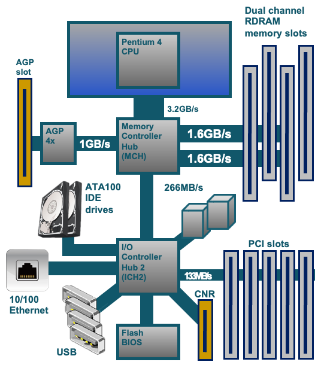
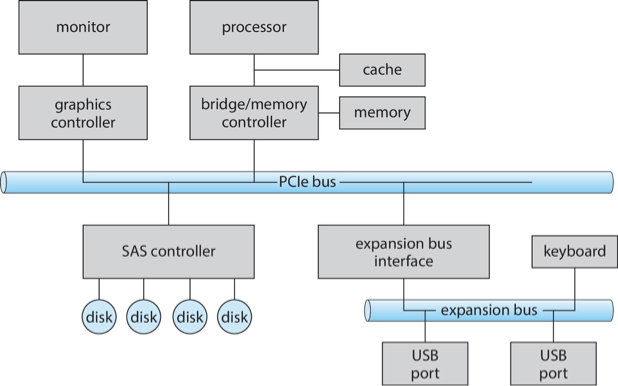
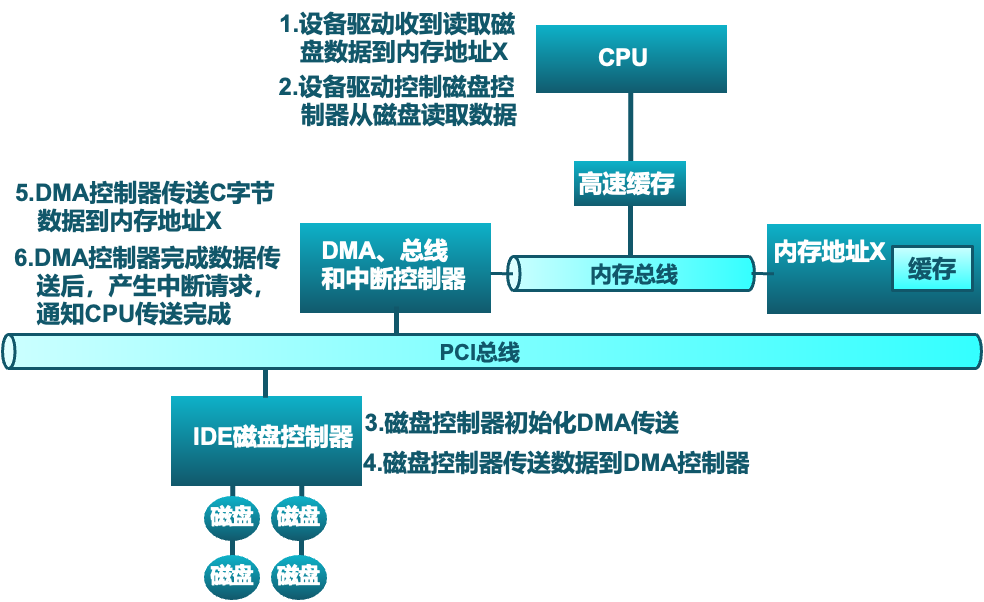
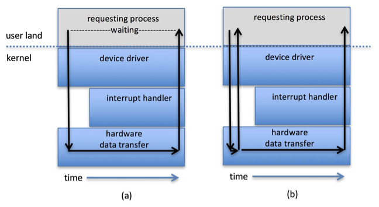
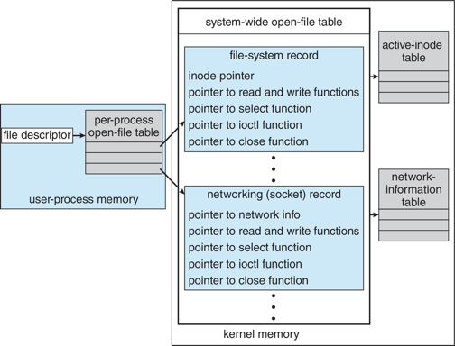

# I/O管理

!!! abstract "课程信息"
    主讲人：陈亮

    单位：计算机学院
    
    日期：2025-06

!!! note "学习目标"
    - 剖析操作系统的I/O子系统；
    - 讨论I/O硬件的原理和复杂性；
    - 解释I/O硬件和软件的性能问题。

## 一、概述

I/O 管理是操作系统设计和运行中的一个主要组成部分，对计算机操作至关重要。I/O 设备种类繁多，控制方法各异，共同构成了I/O子系统。性能管理是I/O管理的一个重要方面，并且新型设备层出不穷。

I/O设备的关键要素包括：

*   **端口 (Ports)**：设备的连接点。
*   **总线 (Busses)**：一组线路和严格定义的协议，用于在线路上传输信息。
*   **设备控制器 (Device Controllers)**：连接各种设备。

**设备驱动程序 (Device Drivers)** 封装了设备的具体细节，向I/O子系统提供统一的设备访问接口。

## 二、I/O 硬件

### 1. I/O 结构示例 (以Pentium 4为例)

典型的PC I/O结构通过芯片组（如北桥和南桥）来协调各个组件之间的数据流：

*   **CPU** 通过高速总线连接到 **北桥 (Memory Controller Hub - MCH)**。
*   **北桥** 主要负责连接高速设备：
    *   内存 (Memory)
    *   AGP/PCI-Express 插槽 (用于显卡等)
*   **北桥** 通过内部总线连接到 **南桥 (I/O Controller Hub - ICH)**。
*   **南桥** 主要负责连接中低速设备：
    *   ATA/IDE (硬盘接口)
    *   PCI 总线 (扩展卡)
    *   USB/Firewire 总线
    *   Serial/Parallel 接口
    *   DMA 控制器
    *   中断控制器
    *   RTC (实时时钟), ACPI (高级配置与电源接口), BIOS 等。

### 2. I/O 设备分类

计算机系统中参与I/O的外设大体上可分为三类：

1.  **存储设备 (Storage)**：如磁盘、磁带。
2.  **传输设备 (Transmission)**：如网络接口卡、调制解调器。
3.  **人机交互设备 (Human-Interface)**：如键盘、鼠标、显示器。

通用概念：

*   **端口 (Port)**：设备的连接点。
*   **总线 (Bus)**：一组线路和通过线路传输信息的严格定义的一个协议。
    *   常见的有 PCI 总线, PCI Express (PCIe)。
    *   扩展总线连接相对较慢的设备。
    *   串行连接 SCSI (SAS) 是公共磁盘接口。

### 3. I/O 设备之间的差别

不同类别设备之间，甚至同一类别不同设备之间，特性和性能差别都很大。

### 4. 典型I/O设备的速率

| 设备类型         | 数据速率        |
| ---------------- | --------------- |
| 键盘             | 10 字节/秒      |
| 鼠标             | 100 字节/秒     |
| 56K 调制解调器   | 7 KB/秒         |
| USB 1.1          | 1.5 MB/秒       |
| IDE 硬盘驱动器   | 最高 133 MB/秒  |
| 以太网 (1Gbps)   | 125 MB/秒       |
| SATA3            | 750 MB/秒       |
| USB 3.0          | 最高 625 MB/秒  |
| PCI Express 3.0 (x16) | 15.75 GB/秒    |
| Thunderbolt 3    | 5 GB/秒         |

*(速率为示例，具体数值可能因技术发展而变化)*

### 5. I/O 控制器 (Controller / Host Adapter)

I/O 控制器是操作端口、总线和设备的一组电子器件。

*   **集成或独立**：有时集成在主板上，有时是独立的电路板（称为主机适配器，Host Adapter）。
*   **内部结构**：包含处理器、微代码 (firmware)、私有内存、总线控制器等。
*   **分层控制**：有些控制器通过总线控制器、微代码、内存等与每个设备的控制器进行通信。
*   **示例**：Fibre Channel (FC) 控制器通常是复杂的主机总线适配器 (HBA)，插入到总线中。

### 6. I/O 硬件交互

*   **I/O 指令**：CPU 使用专门的I/O指令来控制设备。
*   **设备寄存器**：设备通常有寄存器，设备驱动程序在其中放置命令、地址和要写入的数据，或在命令执行后从中读取数据。
    *   **数据输入寄存器 (Data-in register)**
    *   **数据输出寄存器 (Data-out register)**
    *   **状态寄存器 (Status register)**: 包含状态位，如忙/闲、错误、数据就绪等。
    *   **控制寄存器 (Control register)**: 用于发送命令给设备。
    *   大小通常为1-4字节，或实现为FIFO缓冲区。

## 三、CPU 与设备的通信方式

CPU与I/O设备间的接口，通过特殊指令和寄存器实现。通信方式主要有轮询、中断和DMA。

### 1. I/O 指令和内存映射I/O

设备寄存器和存储可以被CPU访问，主要有两种方式：

1.  **I/O 指令 (Port-Mapped I/O, PMIO)**
    *   使用特殊的CPU指令（如 `in`, `out`）通过I/O端口号访问设备寄存器。
    *   示例：`out 0x21, AL`
    *   I/O端口有其独立的地址空间，与内存地址空间分开。

2.  **内存映射I/O (Memory-Mapped I/O, MMIO)**
    *   设备的寄存器/存储被映射到内存的物理地址空间中。
    *   通过常规的内存 `load/store` 指令完成I/O操作。
    *   MMU (内存管理单元) 设置映射，或通过硬件跳线/启动程序设置地址。

!!! info "PC设备中的I/O端口位置示例"
    | I/O 地址范围 (十六进制) | 设备              |
    | --------------------- | ----------------- |
    | `000-01F`             | DMA 控制器        |
    | `020-021`             | 中断控制器        |
    | `040-043`             | 定时器            |
    | `200-20F`             | 游戏控制器        |
    | `2F8-2FF`             | 串行端口 (COM2)   |
    | `320-32F`             | 硬盘控制器        |
    | `378-37F`             | 并行端口          |
    | `3D0-3DF`             | 图形适配器        |
    | `3F0-3F7`             | 软盘驱动器控制器  |
    | `3F8-3FF`             | 串行端口 (COM1)   |

### 2. 轮询 (Polling)

轮询是CPU主动、重复地查询设备状态以确定操作是否完成的方法。

**过程 (以字节I/O为例):**

1.  CPU从状态寄存器读取**忙位 (busy bit)**，直到该位清零。
2.  主机设置**读/写位**，若写入，则将数据复制到**数据输出寄存器**。
3.  主机设置**命令就绪位 (command-ready bit)**。
4.  控制器检测到命令就绪，设置**忙位**。
5.  控制器读取命令寄存器，执行操作（如从数据输出寄存器读取字节并发送给设备）。
6.  传输完成时，控制器清除忙位、错误位、命令就绪位。

!!! note "轮询的特点"
    - **忙等待 (Busy-waiting)**：步骤1是忙等待周期。
    - **适用场景**：如果设备速度快，轮询是合理的。
    - **缺点**：如果设备慢，CPU会浪费大量时间在等待上，效率低下。若错过一个周期，数据可能被覆盖或丢失。
    - **改进**：如果设备很少就绪，可以考虑中断。

### 3. 中断 (Interrupts)

中断是由I/O设备触发的，通知CPU某个事件已发生的机制。

**过程:**

1.  设备驱动程序初始化I/O请求，CPU继续执行其他任务。
2.  I/O控制器完成操作或发生错误后，向CPU发送中断请求信号。
3.  CPU在执行完当前指令后，检查中断请求。
4.  若有中断，CPU保存当前进程的上下文，暂停当前进程。
5.  CPU根据中断信号（通常通过中断向量）找到对应的**中断服务例程 (Interrupt Service Routine, ISR)** 并执行它。
6.  ISR处理中断（如读取数据，检查错误，通知设备驱动）。
7.  处理完毕后，CPU恢复被中断进程的上下文并继续执行。

**中断的特性:**

*   **效率**：比轮询更高效，尤其对于慢速设备。
*   **中断向量**：一个表格，将中断类型映射到对应的ISR地址。
*   **中断优先级**：允许高优先级中断抢占低优先级中断处理。
*   **中断请求线**：
    *   **非屏蔽中断 (NMI)**：通常用于严重错误，不能被忽略。
    *   **可屏蔽中断 (Maskable Interrupt)**：可以被CPU暂时忽略。
*   **中断链**：如果多个设备共享同一中断号，则形成中断链，ISR需要查询链上的设备以确定中断源。
*   **其他用途**：异常处理 (如硬件错误、页错误)、系统调用 (通过陷阱指令)。

### 4. 直接内存访问 (DMA)

DMA用于大量数据传输，允许I/O设备直接与内存交换数据，而无需CPU的直接参与（除了初始化和结束）。

**过程:**

1.  设备驱动程序收到I/O请求（如从磁盘读取数据到内存地址X）。
2.  设备驱动程序设置DMA控制器：
    *   将DMA命令块写入内存，包含：源地址、目标地址、读/写模式、传输字节数。
    *   将命令块的内存地址写入DMA控制器。
3.  设备驱动程序指示磁盘控制器从磁盘读取数据。
4.  磁盘控制器将数据传输给DMA控制器。
5.  DMA控制器获得总线控制权 (Bus Mastering)，直接将数据从设备（或其缓冲区）传输到指定内存地址X。CPU在此期间可以执行其他任务（DMA可能"窃取"总线周期，称为Cycle Stealing，但总体效率高得多）。
6.  DMA控制器完成数据传送后，向CPU发送中断请求，通知传送完成。

!!! success "DMA的优势"
    - **减少CPU开销**：CPU只需在传输开始和结束时介入。
    - **提高数据传输速率**：绕过CPU，直接在设备和内存间传输。
    - **DVMA (Direct Virtual Memory Access)**：支持虚拟地址的DMA控制器，可以进一步提高效率，无需操作系统进行物理地址和虚拟地址之间的转换。

## 四、I/O 请求生命周期

一个I/O请求从用户进程发起，到最终完成并返回结果，经历以下主要阶段：

1.  **用户进程**：发起系统调用（如 `read()`, `write()`）。
2.  **内核I/O子系统**：
    *   接收请求，检查参数合法性。
    *   判断是否已有缓存结果（如读请求的数据已在缓冲区）。
    *   若是，直接与进程交换数据，返回。
    *   若否，向设备驱动发送I/O请求，并可能使进程等待。
3.  **设备驱动程序**：
    *   将抽象的I/O请求转换为具体的设备命令。
    *   向设备控制器发送控制命令。
    *   等待设备操作完成（通常通过中断）。
4.  **硬件设备/设备控制器**：
    *   执行具体的I/O操作。
    *   操作完成时，产生中断。
5.  **中断处理例程**：
    *   CPU接收中断，保存当前状态，跳转到ISR。
    *   ISR确定I/O操作完成状态，获取结果（如数据、错误码）。
    *   通知设备驱动程序。
6.  **设备驱动程序**：
    *   接收中断处理结果。
    *   通知内核I/O子系统操作完成。
7.  **内核I/O子系统**：
    *   唤醒等待的进程。
    *   与进程交换数据（如将读取的数据从内核缓冲区复制到用户缓冲区）。
    *   系统调用返回，将完成结果或错误信息返回给用户进程。

## 五、应用程序 I/O 接口

操作系统通过I/O系统调用将设备行为封装在通用类中，设备驱动程序层则隐藏了不同I/O控制器之间的差异。

### 1. I/O 设备的特点和分类

设备在多个维度上有所不同：

*   **数据传输单元**：
    *   **字符流设备 (Character-stream)**：一次传输一个字符，如键盘、鼠标、串口。命令通常是 `get()`、`put()`。
    *   **块设备 (Block)**：一次传输固定大小的数据块，如磁盘驱动器。命令包括 `read`、`write`、`seek`。支持裸I/O (Raw I/O)、直接I/O或文件系统访问。
*   **访问模式**：
    *   **顺序访问 (Sequential)**：按固定顺序访问数据，如磁带。
    *   **随机访问 (Random-access)**：可直接访问任意位置数据，如磁盘。
*   **同步/异步**：
    *   **同步 (Synchronous)**：I/O操作开始后，进程阻塞直到操作完成。
    *   **异步 (Asynchronous)**：I/O操作开始后，进程继续运行，操作完成后通过某种机制（如信号、回调）通知进程。
*   **共享性**：
    *   **可共享 (Sharable)**：可被多个进程同时访问，如磁盘。
    *   **专用 (Dedicated)**：一次只能被一个进程访问，如打印机。
*   **操作速度**：差异巨大。
*   **操作方向**：读写、只读、只写。

**其他接口类型：**

*   **内存映射文件访问**：文件被映射到虚拟内存，通过缺页中断按需调入数据。
*   **网络套接字 (Network Sockets)**：用于网络通信，如 `connect()`, `accept()`, `send()`, `receive()`。`select()` 等函数支持服务器管理多个套接字。
*   **时钟和定时器**：提供当前时间、流逝时间、定时器功能。可编程间隔定时器用于定时和周期性中断。

!!! tip "`ioctl()` (Unix/Linux)"
    `ioctl()` (Input/Output Control) 是一个特殊的系统调用，用于处理设备特定的、不适合标准读写接口的操作。它可以向设备控制寄存器发送任意命令，或与设备数据寄存器交换数据。例如，设置串口参数、获取磁盘几何信息等。

!!! example "Unix/Linux 设备标识"
    Unix和Linux使用“主设备号 (major)”和“次设备号 (minor)”的元组来唯一标识设备的类型和实例。

    例如，`ls -l /dev/sda*` 可能显示：

    `brw-rw---- 1 root disk 8, 0 Jun 10 10:00 /dev/sda` (主设备号8，次设备号0)

    `brw-rw---- 1 root disk 8, 1 Jun 10 10:00 /dev/sda1` (主设备号8，次设备号1)

### 2. 非阻塞和异步 I/O

*   **阻塞I/O (Blocking I/O)**：进程发起I/O调用后被挂起，直到I/O完成。易于使用和理解，但可能降低并发性。
*   **非阻塞I/O (Nonblocking I/O)**：I/O调用立即返回，返回已成功传输的字节数（可能为0）。常用于用户界面和数据复制（缓冲I/O）。通常通过多线程或 `select()`/`poll()`/`epoll()` 与实际的读写操作结合使用。
*   **异步I/O (Asynchronous I/O)**：进程发起I/O调用后继续运行，I/O操作在后台执行。当I/O完成后，I/O子系统通过信号或回调函数通知进程。使用起来较复杂。

### 3. 向量I/O (Vectored I/O / Scatter-Gather I/O)

向量I/O允许单个系统调用执行多个分散或集中的I/O操作。

*   例如，Unix的 `readv()` 和 `writev()` 接受一个缓冲区描述符向量，可以从多个不连续的内存区域读取数据到设备，或从设备读取数据到多个不连续的内存区域。
*   **优点**：
    *   减少上下文切换和系统调用开销（相比多次单独I/O调用）。
    *   某些实现提供原子性，避免多线程并发修改数据时的问题。

## 六、内核 I/O 子系统

内核I/O子系统提供了一系列服务来管理I/O操作。

### 1. 主要功能

*   **I/O调度 (Scheduling)**：
    *   通过为每个设备维护请求队列来安排I/O请求的顺序。
    *   目标可以是公平性、吞吐量最大化、响应时间最小化等。
    *   一些操作系统实现服务质量 (QoS) 保证 (如 IPQOS)。
*   **缓冲 (Buffering)**：
    *   在内存中临时存储数据，用于设备之间或设备与应用程序之间的数据传输。
    *   **目的**：
        *   处理设备速度不匹配问题。
        *   处理设备传输大小不匹配问题。
        *   维护“拷贝语义”(copy semantics)，确保应用程序操作的是数据的副本，避免数据在传输过程中被意外修改。
    *   **双缓冲 (Double buffering)**：使用两个缓冲区，一个用于填充/处理，另一个用于消耗/使用，交替进行。
    *   **写时复制 (Copy-on-write)**：可用于提高某些情况下的效率。
*   **缓存 (Caching)**：
    *   在更快的设备（通常是内存）中保存较慢设备数据的副本。
    *   **目的**：提高访问速度，因为后续对相同数据的访问可以直接从缓存中获取。
    *   缓存中的数据始终是副本。
    *   对系统性能至关重要。
    *   有时与缓冲结合使用。
*   **假脱机 (Spooling - Simultaneous Peripheral Operations On-Line)**：
    *   将输出数据暂存起来（通常在磁盘上），供那些一次只能处理一个请求的设备（如打印机）按顺序使用。
    *   允许应用程序快速“完成”输出操作，而实际的物理输出由后台进程处理。
*   **设备预留 (Device Reservation)**：
    *   提供对设备的独占访问。
    *   通过系统调用进行分配和释放。
    *   需要注意避免死锁。
*   **错误处理 (Error Handling)**：
    *   操作系统可以从某些I/O错误中恢复，如磁盘读取错误、设备暂时不可用、瞬时写入失败（可以尝试重试）。
    *   高级系统（如 Solaris FMA, AIX）会跟踪错误频率，当可重试错误的频率增加时，可能会停止使用该设备。
    *   I/O请求失败时，通常返回错误号或代码。
    *   系统错误日志记录问题报告。
*   **I/O保护 (I/O Protection)**：
    *   用户进程可能意外或故意通过非法的I/O指令扰乱系统正常运行。
    *   **措施**：
        *   所有I/O指令被定义为**特权指令 (privileged instructions)**，只能在内核模式下执行。
        *   用户模式的I/O请求必须通过**系统调用 (system calls)** 来完成。
        *   内存映射I/O区域和I/O端口内存位置也必须受到保护，防止用户进程直接访问。

### 2. 内核数据结构

内核维护各种数据结构来跟踪I/O组件的状态信息，例如：

*   打开文件表
*   网络连接信息
*   字符设备状态
*   缓冲区管理结构
*   内存分配信息
*   “脏”块（已修改但未写回磁盘的缓存块）列表

一些操作系统采用面向对象的方法和消息传递来实现I/O子系统（如Windows）。

## 七、电源管理 (Power Management)

电源管理虽然不严格属于I/O领域，但许多方面与I/O设备密切相关。

*   **目标**：减少计算机和设备的电力消耗，减少发热，延长电池寿命（移动设备）。
*   **操作系统角色**：
    *   **组件级电源管理**：了解组件间的依赖关系，构建设备树表示物理设备拓扑。
    *   **状态跟踪**：设备驱动程序跟踪设备是否在使用中。未使用的组件或整个树分支可以被关闭以省电。
    *   **唤醒锁 (Wakelocks)** (如Android)：防止设备在特定操作（如数据下载）完成前进入睡眠状态。
    *   **电源崩溃 (Power Collapse)**：使设备进入深度睡眠状态，只保留足够的唤醒能力以响应外部刺激（如按键、来电）。
    *   **ACPI (Advanced Configuration and Power Interface)**：固件标准，提供操作系统可调用的例程，用于设备发现、管理、错误处理和电源管理。
*   **云计算环境**：在服务器间迁移虚拟机，最终可能整合工作负载并关闭空闲服务器。
*   **移动计算**：电源管理是首要考虑因素。

## 八、流式 I/O (STREAMS)

STREAMS 是 Unix System V 及后续版本中引入的一种机制，用于在用户级进程和设备之间建立灵活的全双工通信通道。

*   **组成部分**：
    *   **流头 (Stream head)**：与用户进程接口。
    *   **驱动程序端 (Driver end)**：与物理设备或伪设备接口。
    *   **零个或多个流模块 (Stream modules)**：位于流头和驱动程序端之间，每个模块提供特定的处理功能（如协议处理、数据转换）。
*   **结构**：每个模块包含一个读队列和一个写队列。
*   **通信**：通过消息在队列之间传递。
*   **流控制**：指示队列可用或繁忙。
*   **同步性**：模块间通信是异步的，但用户进程与流头的通信通常是同步的。

## 九、性能

I/O是影响系统整体性能的主要因素。性能瓶颈可能由以下原因造成：

*   CPU执行设备驱动程序和内核I/O代码的开销。
*   中断处理导致的上下文切换。
*   内存中数据的多次复制（如用户缓冲区 <-> 内核缓冲区 <-> 设备缓冲区）。
*   网络流量密度。

### 改进性能的方法

*   **减少上下文切换次数**。
*   **减少数据复制次数**（如使用零拷贝技术）。
*   **减少中断频率**：通过使用大型传输、智能控制器和在适当情况下使用轮询。
*   **使用DMA**。
*   **使用更智能的硬件设备**（卸载部分处理任务到设备控制器）。
*   **平衡CPU、内存、总线和I/O性能**以获得最高吞吐量。
*   将某些用户模式的I/O相关进程/守护进程移至内核线程以减少开销。

## 十、总结

I/O子系统协调了应用程序和内核其他部分可用的大量服务，其核心职责包括：

*   管理文件和设备的名称空间。
*   对文件和设备的访问控制。
*   操作控制（例如，调制解调器不能执行 `seek()` 操作）。
*   文件系统空间分配。
*   设备分配与回收。
*   缓冲、缓存和假脱机。
*   I/O调度。
*   设备状态监视、错误处理和故障恢复。
*   设备驱动程序的配置和初始化。
*   I/O设备的电源管理。

I/O子系统的上层通过设备驱动程序提供的统一接口访问各种不同的硬件设备，从而实现了硬件无关性。